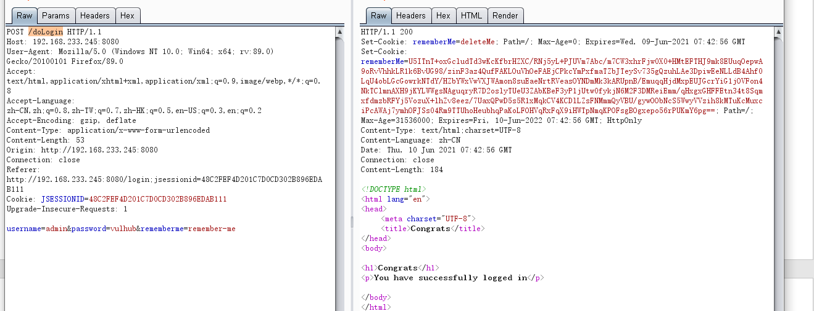
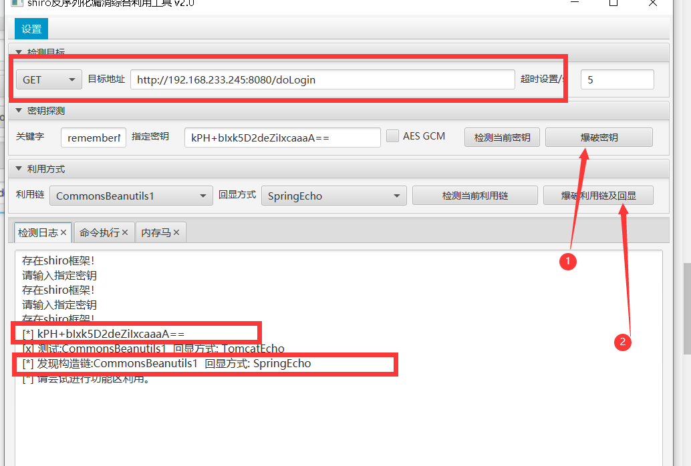
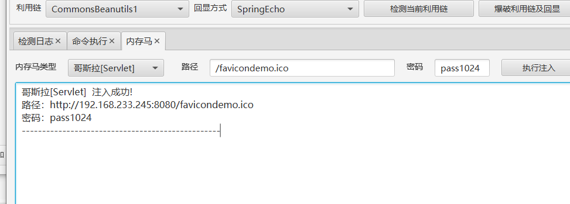
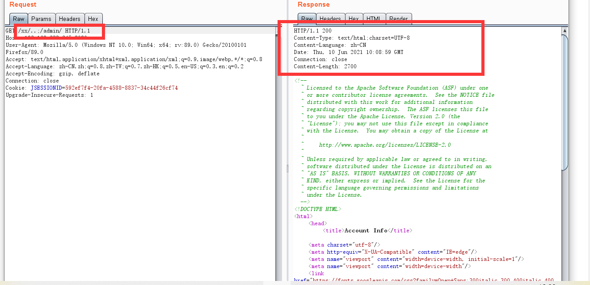

# Apache Shrio漏洞合集

## 简介

Apache Shiro是一个强大且易用的Java安全框架,执行身份验证、授权、密码和会话管理。使用Shiro的易于理解的API,您可以快速、轻松地获得任何应用程序,从最小的移动应用程序到最大的网络和企业应用程序。

### **主要功能**

三个核心组件：Subject, SecurityManager 和 Realms.

Subject：

即“当前操作用户”。但是，在Shiro中，Subject这一概念并不仅仅指人，也可以是第三方进程、后台帐户（Daemon Account）或其他类似事物。它仅仅意味着“当前跟软件交互的东西”。

Subject代表了当前用户的安全操作，SecurityManager则管理所有用户的安全操作。

SecurityManager：

它是Shiro框架的核心，典型的Facade模式，Shiro通过SecurityManager来管理内部组件实例，并通过它来提供安全管理的各种服务。

Realm：
Realm充当了Shiro与应用安全数据间的“桥梁”或者“连接器”。也就是说，当对用户执行认证（登录）和授权（访问控制）验证时，Shiro会从应用配置的Realm中查找用户及其权限信息。

从这个意义上讲，Realm实质上是一个安全相关的DAO：它封装了数据源的连接细节，并在需要时将相关数据提供给Shiro。当配置Shiro时，你必须至少指定一个Realm，用于认证和（或）授权。配置多个Realm是可以的，但是至少需要一个。

Shiro内置了可以连接大量安全数据源（又名目录）的Realm，如LDAP、关系数据库（JDBC）、类似INI的文本配置资源以及属性文件等。如果系统默认的Realm不能满足需求，你还可以插入代表自定义数据源的自己的Realm实现。

### **指纹判断**

返回包存在set-Cookie：rememberMe=deleteMe或URL中有shiro字样。
有时服务器不会主动返回rememberMe=deleteMe，直接发包即可

## **漏洞集合**

### 1. Apache Shiro 1.2.4反序列化漏洞（CVE-2016-4437）

Apache Shiro
1.2.4及以前版本中，加密的用户信息序列化后存储在名为remember-me的Cookie中。攻击者可以使用Shiro的默认密钥伪造用户Cookie，触发Java反序列化漏洞，进而在目标机器上执行任意命令

**漏洞分析：**

Apache
Shiro默认使用CookieRememberMeManager。其处理cookie的流程是：得到rememberMe的cookie值--\>Base64解码--\>AES解密--\>反序列化

浏览器访问8080端口，登录账号密码，默认为admin vulhub

登录的请求包和响应包

使用漏洞利用工具存在shiro框架

在功能区输入命令whoami,显示root

使用哥斯拉注入木马

### **2.Apache Shiro权限绕过复现（CVE-2020-11989）**

**漏洞简介：**

Shiro框架通过拦截器功能来对用户访问权限进行控制，如anon,authc等拦截器。anon为匿名拦截器，不需要登陆即可访问；authc为登录拦截器，需要登录才可以访问。

Shiro的URL路径表达式为Ant格式，路径通配符表示匹配零个或多个字符串，/可以匹配/hello，但是匹配不到/hello/，因为\*通配符无法匹配路径。加入/hello接口设置了authc拦截器，访问/hello会进行权限判断，但如果访问的是/hello/那么将无法正确匹配URL，直接放行，进入到spring拦截器。spring中的/hello和/hello/形式的URL访问的资源是一样的，从而实现权限绕过。

**影响范围：**

Apache Shiro \< 1.5.2

在浏览器上输入/admin/，抓请求包

将路径修改为/xx/..;/admin/则绕过了登录页面

当我们输入/xxx**/;/admin/**时oorg.apache.shiro.web.util.WebUtils\#normalize会将**;**后边进行截取而if
(pathMatches(pathPattern, requestURI)
又会错误的处理**/**导致逻辑绕过，以至于我们可以正常访问/admin/需要授权的页面

**修复方式**

通过WAF检测请求的uri中是否包含%25%32%66关键词

通过WAF检测请求的uri开头是否为/;关键词

升级至Apache Shiro 1.5.3 或更高版本
