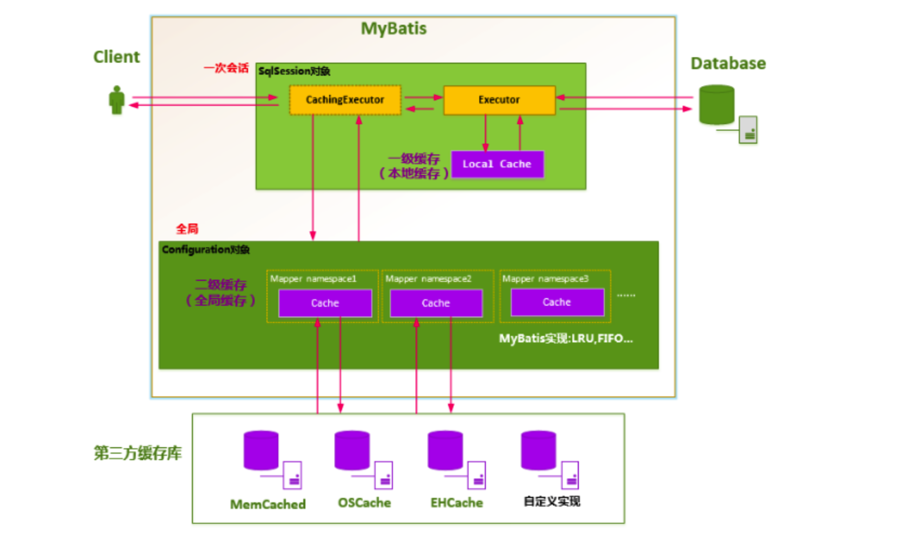
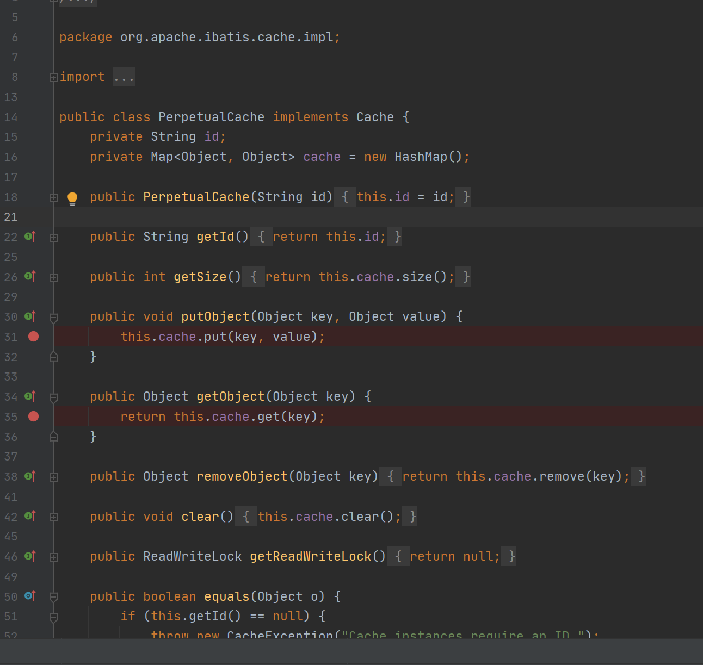
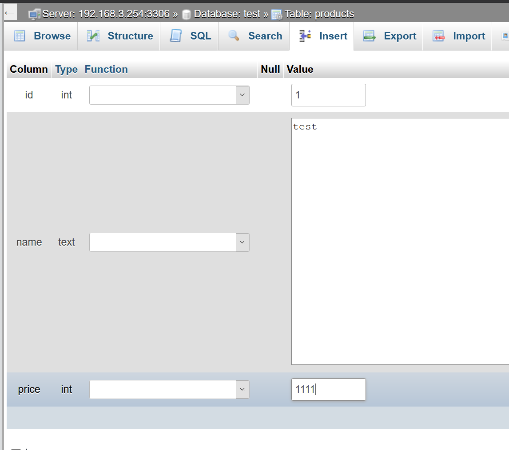
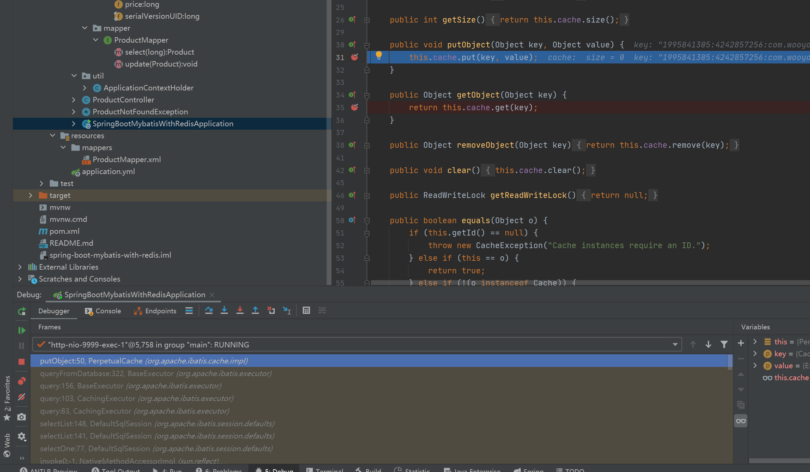
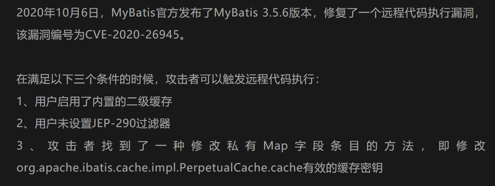

## CVE-2020-26945-mybatis二级缓存反序列化漏洞     

## 0x01 简介

MyBatis 本是Apache的一个开源项目iBatis, 2010年这个项目由Apache Software Foundation  迁移到了Google  Code，并且改名为MyBatis。MyBatis是一款优秀的持久层框架，它支持定制化SQL、存储过程以及高级映射。MyBatis避免了几乎所有的JDBC代码和手动设置参数以及获取结果集。MyBatis可以使用简单的XML或注解来配置和映射原生信息，将接口和 Java 的 POJOs(Plain Ordinary Java Object,普通的 Java对象)映射成数据库中的记录。

漏洞描述2020年10月6日，MyBatis官方发布了MyBatis 3.5.6版本，修复了一个远程代码执行漏洞，该漏洞编号为CVE-2020-26945。

### 利用条件

1. 用户启用了二级缓存功能
2. 攻击者可以修改缓存的内容，替换为恶意反序列化数据
3. 用户未设置JEP-290过滤，且没有任何防御反序列化攻击的措施

## 0x02 分析



二级缓存其实就是将查询的结果，放入缓存中，下次查询相同的条件时，直接从缓存中获取结果，降低sql服务器的压力。如上图所示，二级缓存可以缓存在redis等kv数据库，也可以我们自己实现相关缓存。

如果我们需要自定义缓存，只需要集成如下接口即可

```
public interface Cache {
String getId();
int getSize();
void putObject(Object key, Object value);
Object getObject(Object key);
boolean hasKey(Object key);
Object removeObject(Object key);
void clear();
}
```

二级缓存默认是不开启的，需要手动开启二级缓存，实现二级缓存的时候，MyBatis要求返回的POJO必须是可序列化的。开启二级缓存的条件也是比较简单，通过直接在 MyBatis 配置文件中通过

```
<settings>
        <setting name = "cacheEnabled" value = "true" /></settings>
```

来开启二级缓存，还需要在 Mapper 的xml 配置文件中加入 `<cache>` 标签

二级缓存中，被缓存的对象必须是继承自
 `Serializable`接口，缓存的过程其实就是将POJO反序列化后，存入缓存中。

## 0x03 复现

在网上随便下载一个spring boot 二级缓存的学习项目，本地搭建就行。我用  https://github.com/Lovelcp/spring-boot-mybatis-with-redis 搭建

修改 ProductMapper.xml 配置文件如下

```
<?xml version="1.0" encoding="UTF-8" ?>
<!DOCTYPE mapper
        PUBLIC "-//mybatis.org//DTD Mapper 3.0//EN"
        "http://mybatis.org/dtd/mybatis-3-mapper.dtd">
<mapper namespace="com.wooyoo.learning.dao.mapper.ProductMapper">

    <cache type="org.apache.ibatis.cache.impl.PerpetualCache"/>

    <select id="select" resultType="Product">
        SELECT * FROM products WHERE id = #{id} LIMIT 1
    </select>

    <update id="update" parameterType="Product" flushCache="true">
        UPDATE products SET name = #{name}, price = #{price} WHERE id = #{id} LIMIT 1
    </update>
</mapper>
```

然后在` org.apache.ibatis.cache.impl.PerpetualCache` 相关位置打上断点
 

设置好mysql数据库，建库建表，修改配置文件 如下图所示



application.yml

```
spring:
  # 数据库配置
  datasource:
    url: jdbc:mysql://192.168.3.254/test?autoReconnect=true&useSSL=false
    username: root
    password: 123456
    driver-class-name: com.mysql.jdbc.Driver
```

浏览器访问
 http://127.0.0.1:9999/product/1
 我们可以看到，二级缓存生效了，将结果已经存储到我们预先设定的缓存中，截图如下
 


当然，key与value并没有被序列化，因为系统默认的这个缓存，并不会序列化反序列化。

下面我们看一下mybatis 官方redis `mybatis/redis-cache`缓存插件，相关操作

```
  @Override
  public void putObject(final Object key, final Object value) {
    execute(new RedisCallback() {
      @Override
      public Object doWithRedis(Jedis jedis) {
        final byte[] idBytes = id.getBytes();
        jedis.hset(idBytes, key.toString().getBytes(), redisConfig.getSerializer().serialize(value));
        if (timeout != null && jedis.ttl(idBytes) == -1) {
          jedis.expire(idBytes, timeout);
        }
        return null;
      }
    });
  }

  @Override
  public Object getObject(final Object key) {
    return execute(new RedisCallback() {
      @Override
      public Object doWithRedis(Jedis jedis) {
        return redisConfig.getSerializer().unserialize(jedis.hget(id.getBytes(), key.toString().getBytes()));
      }
    });
  }
```

在这里我们可以很明显的看出，将对象反序列化后存储至redis服务器中。
 

替换里面的数据为我们反序列化的攻击内容即可。

## 0x04 防御措施

1. 启用的二级缓存没有问题，问题在于，缓存服务器**是否允许任意用户访问**？？
2. 如果确认自己的业务没有二级缓存或者二级缓存服务器对外不可见，可以暂时不用处理该漏洞
3. 如果二级缓存服务器对外，重点检查第三方缓存是否使用java反序列化

## 吐槽

某实验室，你自己看看你翻译的那玩意，看完一脸懵逼



## 参考

1. https://github.com/mybatis/mybatis-3/pull/2079