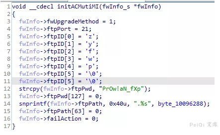
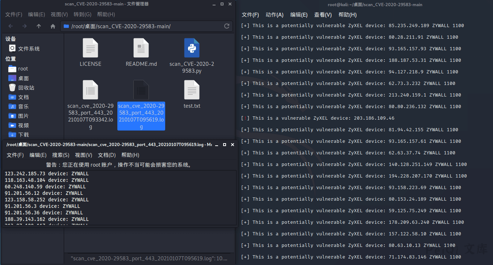
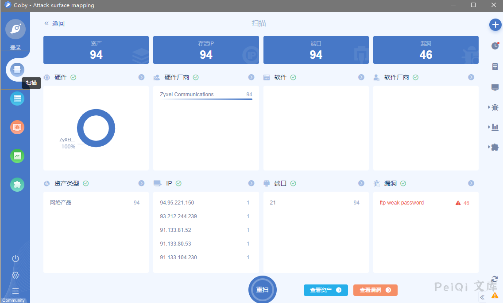

# Zyxel-硬编码后门账户漏洞-CVE-2020-29583

## 漏洞描述

Zyxel固件中发现的后门被称为关键固件漏洞，CVE编号CVE-2020-29583，得分为7.8 CVSS。虽然CVSS评分看似不是很高，但却不可小觑。研究人员表示，这是一个极为严重的漏洞，所有者必须立即更新其系统。因为任何人都可以轻松利用这个漏洞，从DDoS僵尸网络运营商到勒索软件团体和政府资助的黑客。

通过滥用后门账户，网络罪犯可以访问易受攻击的设备并感染内部网络以发起其他攻击。攻击者可以使用管理特权登录设备，并轻易破坏网络设备。

## 漏洞影响

> [!NOTE]
>
> Zyxel USG系列
>
> Zyxel ATP系列
>
> Zyxel NCX系列
>
> Zyxel USG FIEX系列
>
> Zyxel VPN系列

##  FOFA

> [!NOTE]
>
> title="USG40" 
>
> "NXC2500" 等

## 漏洞复现

分析固件中有 FTP 的后门密码

使用[漏洞扫描脚本](https://github.com/2d4d/scan_CVE-2020-29583)找到易受攻击的版本

进行攻击，登录为后门管理员账户 **zyfwp:PrOw!aN_fXp**

这里使用Goby设置字典扫描即可

## 参考文章

[scan_CVE-2020-29583](https://github.com/2d4d/scan_CVE-2020-29583)

[Zyxel USG Series 账户硬编码漏洞（CVE-2020-29583）](https://www.seebug.org/vuldb/ssvid-99089)