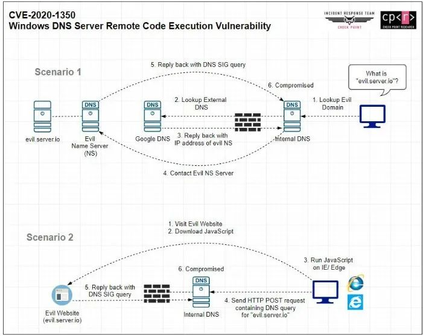
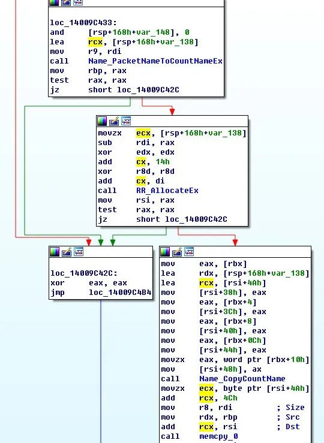
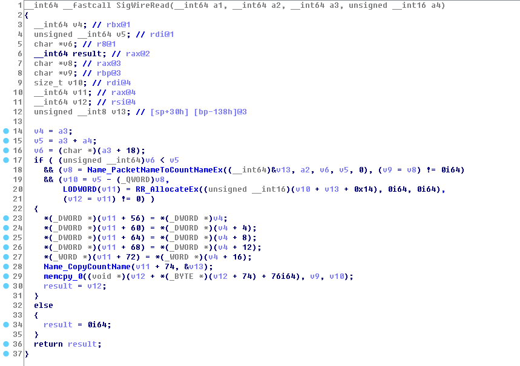
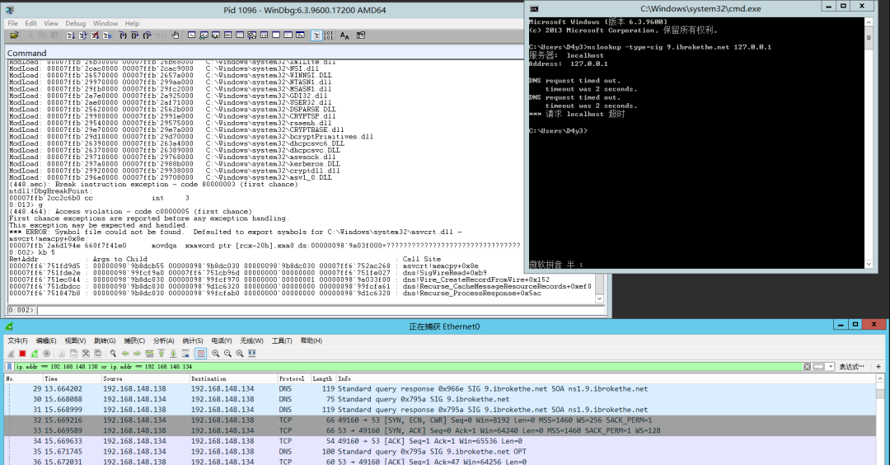

## 0x00 漏洞背景

Windows-DNS--Server远程代码执行漏洞（CVE-2020-1350）：未经身份验证的攻击者可通过向目标DNS服务器发送特制数据包从而目标系统上以本地SYSTEM账户权限执行任意代码。该漏洞无需交互、不需要身份认证且Windows DNS Server默认配置可触发，攻击场景如下:



（注：图来自互联网）

利用场景1：

（1）受害者访问攻击者域名"evil.server.io"

（2）本地DNS服务器或域内的DNS服务器无法解析"evil.server.io"，向google DNS服务器（如8.8.8.8）查询

（3）查到后，发现该域名可以由攻击者DNS服务器解析，所以将该信息缓存到域服务器上

（4）第二次查询时，直接和攻击者DNS服务器进行查询

（5）此时攻击者服务器就可以构造响应包触发漏洞

在复现过程中，笔者省略了（1）、（2）、（3）步，直接在本地DNS服务器上将攻击者服务器地址设为转发器，在本地无法解析"evil.server.io"时，转而向攻击者DNS服务器进行查询。

## 0x01 漏洞分析

DNS包格式：

[外链图片转存失败,源站可能有防盗链机制,建议将图片保存下来直接上传(img-gpFNO5D3-1595035305870)(data:image/gif;base64,iVBORw0KGgoAAAANSUhEUgAAAAEAAAABCAYAAAAfFcSJAAAADUlEQVQImWNgYGBgAAAABQABh6FO1AAAAABJRU5ErkJggg==)]

UDP：表示DNS查询基于UDP协议传输数据。DNS服务器支持TCP和UDP两种协议的查询方式。

Destination port：目的端口默认是53。

QR：0表示查询报文；1表示回应报文。

TC：表示“可截断的”。如果使用UDP时，当应答报文超过512字节时，只返回前512个字节。通常情况下，DNS查询都是使用UDP查询，UDP提供无连接服务器，查询速度快，可降低服务器的负载。当客户端发送DNS请求，并且返回响应中TC位设置为1时，就意味着响应的长度超过512个字节，而仅返回前512个字节。这种情况下，客户端通常采用TCP重发原来的查询请求，并允许返回的响应报文超过512个字节。直白点说，就是UDP报文的最大长度为512字节，而TCP则允许报文长度超过512字节。当DNS查询超过512字节时，协议的TC标志位会置1，这时则使用TCP发送。

Queries：表示DNS请求的域名和类型。

漏洞点在于dns.exe!SigWireRead，该函数用于处理SIG类型的响应包，RR_AllocateEx  分配大小的参数由寄存器cx传入，只有16个bit，大小为0~65535，所以只要构造size  大于65535，造成溢出，就会分配一个比实际数据量小的堆块，造成堆溢出，将整数溢出转化成堆溢出漏洞。



伪代码如下：



RR_AlloccateEx用于分配堆块，第一个参数为分配的大小，由`[Name_PacketNameToCountNameEx result] + [0x14] + [The Signature field’s length (rdi–rax)]` 决定。

所以要触发漏洞，我们需要发送大于64KB的SIG类型响应包给受害者DNS服务器，但是基于UDP传输的DNS包限制大小为512个字节（支持EDNS0的限制大小为4096个字节），不足以触发漏洞。

PoC的思路是通过设置TC标志位，通知客户端采用TCP重发原来的查询请求，并允许返回的响应报文超过512个字节。如下：


但是利用TCP传输的DNS包限制大小为65535，还是不足以触发漏洞，这时候需要用到DNS域名压缩。

完整的域名表示，如www.google.com，需要16个字节：

| 1    | 2    | 3    | 4    | 5    | 6    | 7    | 8    | 9    | 10   | 11   | 12   | 13   | 14   | 15   | 16   |
| ---- | ---- | ---- | ---- | ---- | ---- | ---- | ---- | ---- | ---- | ---- | ---- | ---- | ---- | ---- | ---- |
| \3   | w    | w    | w    | \6   | g    | o    | o    | g    | l    | e    | \3   | c    | o    | m    | \0   |

采用[ ]的形式存储。本例中将域名分成了三段，分别是www，google，com。每一段开头都有一个字节，表示后面域名的长度，最后以\0结尾。由于规定域名段的长度不能超过63个字节，所以表示域名段长度的字节最高两位没有用到，因此另有用途。

（1）当最高两位为00时，表示以上面的形式的传输

（2）当最高两位为11时，表示将域名进行压缩，该字节去掉最高两位后剩下的6位，以及后面的8位总共14位，指向DNS数据报文中的某一段域名，相当于一个指针。如0xc00c, 表示从DNS正文（UDP payload）的偏移offset=0x0c处所表示的域名。

（3）混合表示：以www.google.com为例，假设该域名位于DNS报文偏移0x20处，可能的用法有：

a、0xc020：表示完整域名www.google.com

b、0xc024：从完整域名的第二段开始，指代google.com

c、0x016dc024：0x01表示后面跟的size大小1，0x6d表示字符m，所以0x016d表示字符串"m"，第二段0xc024指代google.com，因此整段表示m.google.com

Name_PacketNameToCountNameEx函数会根据Signers Name 来获取域名的大小。因此0xc00c（偏移从Transaction ID 0x795a开始计算）指向正常域名9.ibrokethe.net，大小则为0x11。

[外链图片转存失败,源站可能有防盗链机制,建议将图片保存下来直接上传(img-z2rI7Hdk-1595035305879)(data:image/gif;base64,iVBORw0KGgoAAAANSUhEUgAAAAEAAAABCAYAAAAfFcSJAAAADUlEQVQImWNgYGBgAAAABQABh6FO1AAAAABJRU5ErkJggg==)]

但通过设置Signer’s  Name为0xc00d，将域名起始位置指向"9"，此时会将"9"当作，将后面的0x39个字节当作域名段，并且一直解析下去，直至解析到’\0’。如下图，Name_PacketNameToCountNameEx会将图中选中的部分当成域名，获取大小。此时大小为(0x39+1)+(0xf+1)*5 +1 =0x8b。（0x39和0xf表示域名段大小，+1表示"."， 最后一个+1表示"\0"）。

[外链图片转存失败,源站可能有防盗链机制,建议将图片保存下来直接上传(img-20X5AEwn-1595035305880)(data:image/gif;base64,iVBORw0KGgoAAAANSUhEUgAAAAEAAAABCAYAAAAfFcSJAAAADUlEQVQImWNgYGBgAAAABQABh6FO1AAAAABJRU5ErkJggg==)]

windbg调试结果：


[rsp+0x30h]为传入Name_PacketNameToCountNameEx的第一个参数，保存获取域名的大小。而后面的(rdi–rax)表示我们填充到Signature的数据大小，rdi为数据结束地址，rax为起始地址（从Signer’s Name后开始计算）。


计算完大小为0xffaa：


所以最后传入RR_AllocateEx函数的大小为 (0x8b+0x14+0xffaa)&0xffff= 0x49


之后将Signature的数据复制到分配的空间：


dns!memcpy 目标地址Dst为RR_AllocateEx分配地址+域名大小（0x8b）+0x4c处，源地址Src为Signature数据起始地址，Size为Signature数据大小（0xffaa）。最终造成溢出，产生崩溃。



PoC建立TCP连接后，发送的包构造如下：

```
 # SIG Contents
sig = "\x00\x01" # Type covered
sig += "\x05" # Algorithm - RSA/SHA1
sig += "\x00" # Labels
sig += "\x00\x00\x00\x20" # TTL
sig += "\x68\x76\xa2\x1f" # Signature Expiration
sig += "\x5d\x2c\xca\x1f" # Signature Inception
sig += "\x9e\x04" # Key Tag
sig += "\xc0\x0d" # Signers Name - Points to the '9' in 9.domain.
sig += ("\x00"*(19 - len(domain)) + ("\x0f" + "\xff"*15)*5).ljust(65465 - len(domain_compressed), "\x00") # Signature - Here be overflows!
        ……
# Msg Size + Transaction ID + DNS Headers + Answer Headers + Answer (Signature)
connection.sendall(struct.pack('>H', len_msg) + data[2:4] + response + hdr + sig)
12345678910111213
```

上述构造的信息抓包内容如下：


整个交互过程如下（受害者DNS服务器抓包结果）：


192.168.148.134为受害者IP，192.168.148.138为攻击者IP。

（1）受害者向攻击者查询 9.ibrokethe.net

（2）攻击者返回一个响应包，设置TC位，通知客户端采用TCP重发原来的查询请求，并允许返回的响应报文超过512个字节

（3）受害者就和攻击者建立TCP连接

（4）受害者重新向攻击者查询 9.ibrokethe.net

（5）攻击者利用TCP传输大于64KB的响应包给受害者，触发漏洞，造成溢出