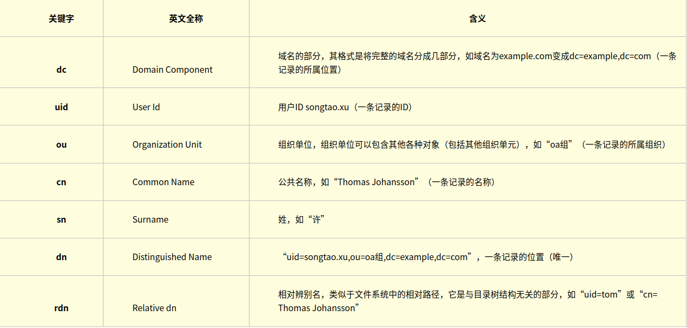
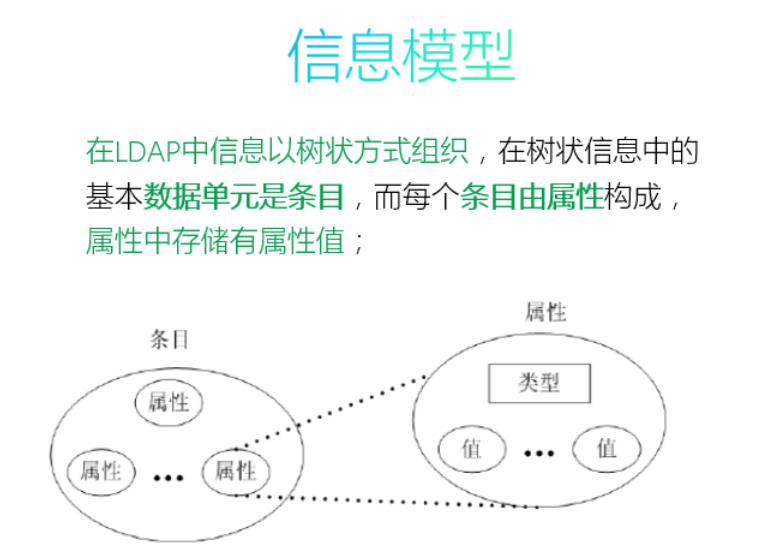
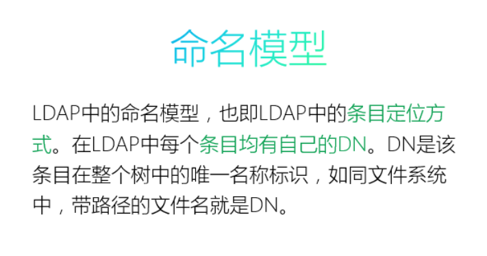
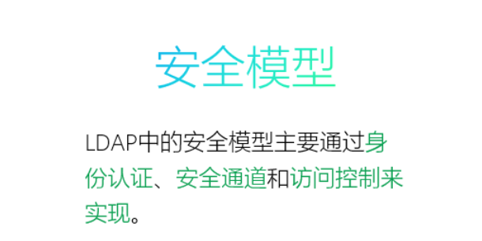

# LDAP协议

## 简介

LDAP(Light Directory Access Protocal)是一个基于X.500标准的轻量级目录访问协议，LDAP是支持跨平台的Internet协议，只需要通过LDAP做简单的配置就可以与服务器做认证交互。可以大大降低开发的成本


## 主要产品

LDAP是一个访问协议，数据存储如下


## 基本模型

### 目录树概念

1. 目录树：在一个目录服务系统中，整个目录信息集可以表示为一个目录信息树，树中的每个节点是一个条目。

2. 条目：每个条目就是一条记录，每个条目有自己的唯一可区别的名称（DN）。

3. 对象类：与某个实体类型对应的一组属性，对象类是可以继承的，这样父类的必须属性也会被继承下来。

4. 属性：描述条目的某个方面的信息，一个属性由一个属性类型和一个或多个属性值组成，属性有必须属性和非必须属性。


### 关键字




### 基本模型

信息模型




命名模型




功能模型


安全模型




## LDAP利用

利用LDAP收集信息，比如操作系统、权限、用户、ip段、杀软、端口、进程、服务、补丁、计划任务、共享、会话


### LDAPsearch获取信息

安装教程如下:https://blog.csdn.net/qq_41037945/article/details/91046770

该工具只能在域环境下使用，因此一般当获得shell后，挂socks代理，在本地进行操作查询.前提是能够访问DC的389端口，且已经知道域内的一个账号密码

参数说明:

```
-x：进行简单认证
-H：服务器地址
-D：用来绑定服务器的DN
-w：绑定DN的密码
-b：指定要查询的根节点
```


**获取所有信息**


